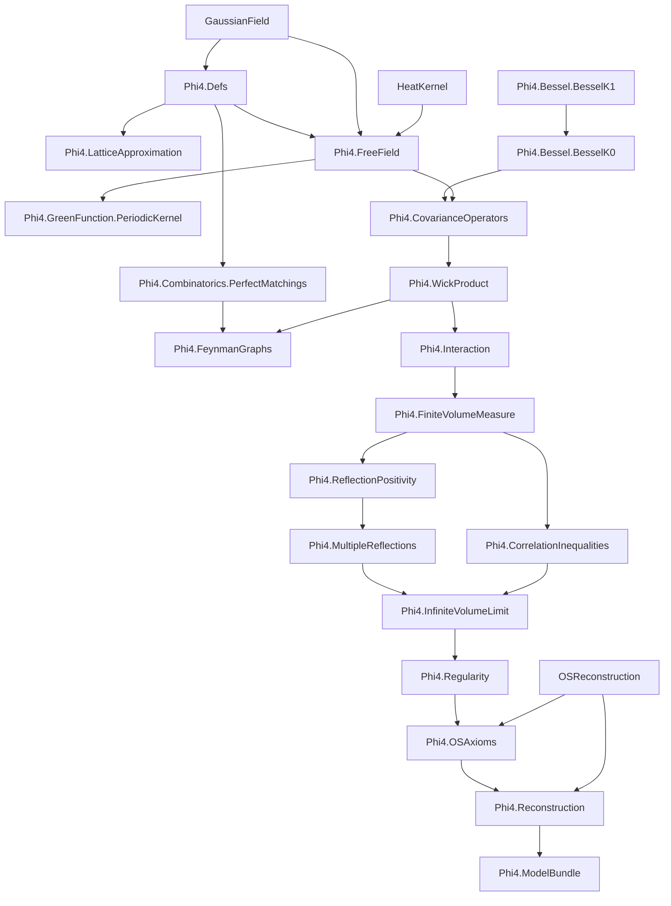

# Phi4: Formal Construction of the φ⁴₂ Quantum Field Theory

A Lean 4 formalization of constructive 2D φ⁴ Euclidean QFT, with the end goal:

1. prove Osterwalder-Schrader (OS) axioms for the infinite-volume theory, and
2. obtain the corresponding Wightman QFT.

Primary reference: Glimm-Jaffe, *Quantum Physics: A Functional Integral Point of View* (2nd ed.).

## Canonical Goal And Architecture (Authoritative)

All local development and documentation in this repository is organized around one target:

1. formalize the Glimm-Jaffe construction of 2D `φ⁴` in infinite volume,
2. prove OS axioms (OS0-OS4, with explicit weak-coupling handling for OS4),
3. reconstruct the corresponding Wightman theory.

Architecture is interpreted in this order:

1. finite-volume construction and estimates,
2. infinite-volume limit and moment/measure bridges,
3. OS packaging and weak-coupling cluster input,
4. reconstruction to Wightman.

`...Model` interfaces are explicit proof-debt boundaries for this pipeline. Any
upstream `OSReconstruction` blocker triage is secondary support work, not the
project objective.

## Module Guide Index

Local per-folder guides are available at:

- `Phi4/Bessel/README.md`
- `Phi4/Combinatorics/README.md`
- `Phi4/FeynmanGraphs/README.md`
- `Phi4/GreenFunction/README.md`
- `Phi4/Interaction/README.md`
- `Phi4/InfiniteVolumeLimit/README.md`
- `Phi4/Reconstruction/README.md`
- `Phi4/Scratch/README.md`

## Status Snapshot (2026-03-04)

- Core modules (`Phi4/**/*.lean`, excluding `Phi4/Scratch`):
  - theorem-level `sorry` count: `0`,
  - `axiom` declarations: `0`,
  - `def`/`abbrev`-level `sorry`: `0`.
- Scratch modules (`Phi4/Scratch/**/*.lean`) theorem-level `sorry` count: `0`.
- Build status: targeted gates (`scripts/quick_gate.sh`,
  `scripts/route_bloat_guard.sh`) pass.
- Trust audit script checks:
  - no explicit axioms,
  - no `def/abbrev := by sorry`,
  - selected trusted interface/bundle endpoints are free of `sorryAx`.
- Completion framing:
  - zero theorem-level `sorry` in core means no hidden placeholders in proved
    statements, not that the full construction is complete.
  - remaining frontier obligations are explicit: `58` `...Model` interfaces and
    `10` canonical theorem-level `gap_*` frontiers.
- Dependency reproducibility:
  - `GaussianField` and `OSReconstruction` are pinned to commit hashes in
    `lakefile.lean` (no floating `@ "main"`).
- Frontier transparency:
  - machine-readable frontier inventory is emitted at
    `docs/frontier_obligations/frontier.tsv` via
    `scripts/frontier_report.sh`.
- Scratch hygiene:
  - local scratch inventory is guarded by `scripts/scratch_guard.sh`
    (count and naming caps) and checked in `scripts/quick_gate.sh`.
- Open frontier obligations are represented explicitly as theorem-level `gap_*`
  endpoints and interface assumptions (`...Model` classes), not hidden in
  definitions.
- Upstream OS-to-Wightman adapter risk is isolated in
  `Phi4/ReconstructionUpstream.lean`; core reconstruction remains
  backend-abstract via `WightmanReconstructionModel`.
- `Phi4/InfiniteVolumeLimit/Part1.lean` now tightens public endpoints to match
  true dependencies: `schwinger_uniformly_bounded` drops an unused limit input,
  `infinite_volume_schwinger_exists` drops an unused uniform-bound input, and
  `gap_infiniteVolumeSchwingerModel_nonempty` is the direct constructor rather
  than an alias wrapper.
- Current sharpest WP1 blocker (Glimm-Jaffe Theorem 8.6.2 hard core):
  prove per-rectangle uniform cutoff partition-function control
  `∫ exp(-q · interactionCutoff(κ_{n+1})) dφ_C ≤ D(Λ, q)` (for each `q > 0`,
  uniform in `n`), together with quantitative shifted UV-difference control.
  This is now consumed directly by the production hard-core bridges
  `interactionWeightModel_nonempty_of_sq_moment_polynomial_bound_per_volume_and_uniform_partition_bound`
  (`Part1Tail`) and
  `interactionIntegrabilityModel_nonempty_of_sq_integrable_data_and_sq_moment_polynomial_bound_per_volume_and_uniform_partition_bound`
  (`Part3`).

### Recent Infrastructure Progress

- `Phi4/FeynmanGraphs/LocalizedBounds.lean` now includes weighted occupancy
  inequalities, including graph-specialized bounds:
  `∏ (N! * A^N) ≤ (∑ N)! * A^(∑ N)`.
- `Phi4/FeynmanGraphs/LocalizedBounds.lean` now also includes generic
  degree-capped weighted-to-vertex-exponential bridges:
  `graphIntegral_abs_le_const_pow_vertices_of_degree_weighted_bound` and
  `feynman_expansion_abs_le_uniform_const_pow_vertices_of_degree_weighted_family`
  (the latter adds graph-count growth control `#graphs ≤ N^{|V|}`), plus
  explicit and all-arity forms:
  `feynman_expansion_abs_le_explicit_uniform_const_pow_vertices_of_degree_weighted_family`,
  `gaussian_moment_abs_le_explicit_uniform_const_pow_of_degree_weighted_expansion_data`,
  `gaussian_moment_abs_le_uniform_const_pow_of_degree_weighted_expansion_data`.
- `Phi4/FeynmanGraphs/LocalizedBounds.lean` now also packages local φ⁴
  weighted-family finite-expansion bounds into all-arity Gaussian-moment
  endpoints:
  `gaussian_moment_abs_le_explicit_uniform_const_pow_of_phi4_weighted_expansion_data_local`
  and
  `gaussian_moment_abs_le_uniform_const_pow_of_phi4_weighted_expansion_data_local`.
- `Phi4/Interaction.lean` now includes reusable bridges from lower bounds to
  Boltzmann-weight integrability:
  - `memLp_exp_neg_of_ae_lower_bound`,
  - cutoff-sequence transfer lemmas (all-`n` and eventually-`n`),
  - Borel-Cantelli tail bridges from summable cutoff bad-event sets to
    eventual almost-sure lower bounds, plus variants using summable
    bad-event majorants `μ(badₙ) ≤ εₙ` and geometric tails
    `μ(badₙ) ≤ C rⁿ` (`r < 1`), including exponential-tail specializations
    `μ(badₙ) ≤ C * exp(-α n)` (`α > 0`),
  - constructor paths to instantiate
    `InteractionWeightModel`/`InteractionIntegrabilityModel` from cutoff lower
    bound data.
- `Phi4/Interaction/Part1Core.lean` and `Phi4/Reconstruction/Part1Core.lean`
  now also expose direct `q > 0` geometric exponential-moment WP1 entry points:
  `interactionWeightModel_nonempty_of_standardSeq_succ_tendsto_ae_and_geometric_exp_moment_bound`,
  `interactionWeightModel_nonempty_of_tendsto_ae_and_geometric_exp_moment_bound`,
  and
  `gap_phi4_linear_growth_of_tendsto_ae_and_geometric_exp_moment_bound`; the
  same shape is now propagated through the squared-moment bridge via
  `interactionWeightModel_nonempty_of_sq_moment_polynomial_bound_and_geometric_exp_moment_bound`
  and
  `gap_phi4_linear_growth_of_sq_moment_polynomial_bound_and_geometric_exp_moment_bound`,
  matching the Glimm-Jaffe 8.6.2 hypothesis shape without requiring a geometric
  assumption at `p = 0`.
- `Phi4/Interaction/Part1Tail.lean` now includes a deterministic-growth bridge
  from linear shifted-cutoff lower bounds to geometric exponential moments:
  `standardSeq_succ_geometric_exp_moment_bound_of_linear_lower_bound`,
  plus the direct model constructor
  `interactionWeightModel_nonempty_of_tendsto_ae_and_linear_lower_bound`; this
  is propagated to reconstruction via
  `gap_phi4_linear_growth_of_tendsto_ae_and_linear_lower_bound` in
  `Phi4/Reconstruction/Part1Core.lean`.
- `Phi4/Interaction/Part1Tail.lean` now also includes a hard-core WP1 assembly
  route with per-volume constants:
  `interactionCutoff_standardSeq_succ_tendsto_ae_of_sq_moment_polynomial_bound_to_interaction`
  and
  `interactionWeightModel_nonempty_of_sq_moment_polynomial_bound_per_volume_and_uniform_partition_bound`.
  The same route is now generalized to higher even moments (`2j`, `j > 0`) via
  `interactionCutoff_standardSeq_succ_tendsto_ae_to_interaction_of_higher_moment_polynomial_bound`
  and
  `interactionWeightModel_nonempty_of_higher_moment_polynomial_bound_per_volume_and_uniform_partition_bound`.
- `Phi4/Interaction/Part1Tail.lean` now also includes a Cauchy/AM-GM bad-part
  infrastructure for the Theorem 8.6.2 decomposition chain:
  - `standardSeq_succ_exp_moment_integral_on_bad_set_le_of_memLp_two`,
  - `toReal_geometric_bad_set_bound_of_ennreal`,
  - `standardSeq_succ_geometric_bad_part_integral_bound_of_sq_exp_moment_geometric_and_bad_measure_geometric`,
  - `standardSeq_succ_geometric_bad_part_integral_bound_of_sq_exp_moment_geometric_and_bad_measure_geometric_ennreal`,
  - `standardSeq_succ_geometric_exp_moment_bound_of_linear_lower_bound_off_bad_sets_and_sq_exp_moment_geometric_and_bad_measure_geometric`.
  - `standardSeq_succ_geometric_exp_moment_bound_of_linear_lower_bound_off_bad_sets_and_sq_exp_moment_geometric_and_bad_measure_geometric_ennreal`.
  - `standardSeq_succ_sq_exp_moment_data_of_double_exponential_moment_geometric_bound`.
  - `standardSeq_succ_geometric_exp_moment_bound_of_linear_lower_bound_off_bad_sets_and_double_exp_moment_geometric_and_bad_measure_geometric_ennreal`.
  It now also includes linear-threshold Chernoff bridges that turn geometric
  shifted-cutoff exponential-moment hypotheses directly into ENNReal geometric
  bad-set tails for sublevel events `{interactionCutoff(κ_{n+1}) < a*n - b}`:
  - `shifted_cutoff_bad_event_geometric_bound_of_exponential_moment_bound_linear_threshold`,
  - `shifted_cutoff_bad_event_exists_ennreal_geometric_bound_of_exponential_moment_bound_linear_threshold`,
  - `shifted_cutoff_bad_event_geometric_bound_of_exponential_moment_abs_bound_linear_threshold`,
  - `shifted_cutoff_bad_event_exists_ennreal_geometric_bound_of_exponential_moment_abs_bound_linear_threshold`.
  This isolates the remaining hard core to proving the two quantitative inputs:
  geometric second-moment bounds and geometric bad-set measure bounds.
- `Phi4/Interaction/Part3.lean` now also exposes the matching full-model
  constructor from explicit bad-set decomposition data with ENNReal tails:
  `interactionIntegrabilityModel_nonempty_of_sq_integrable_data_and_linear_lower_bound_off_bad_sets_and_sq_exp_moment_geometric_and_bad_measure_geometric_ennreal`.
  A doubled-moment entry point is now also available:
  `interactionIntegrabilityModel_nonempty_of_sq_integrable_data_and_linear_threshold_geometric_exp_moment_and_double_exp_moment_geometric`,
  which derives the `MemLp`-2 and squared-moment decomposition inputs
  internally from geometric `exp(-(2q) * interactionCutoff)` bounds.
  A weaker-assumption variant is also available:
  `interactionIntegrabilityModel_nonempty_of_sq_integrable_data_and_linear_threshold_geometric_exp_moment_and_double_exp_moment_geometric_of_moment_bounds`,
  which additionally derives `q`-level integrability from `MemLp(·,2)` under
  the free-field probability measure.
  A mixed signed/absolute doubled-moment route is also available:
  `interactionIntegrabilityModel_nonempty_of_sq_integrable_data_and_linear_threshold_geometric_exp_moment_and_double_exp_moment_abs_geometric_of_moment_bounds`,
  which keeps the `q` branch signed while accepting the `2q` branch in
  absolute form `exp((2q) * |interactionCutoff|)`.
  The same route now also has concrete partition-function endpoints:
  `partition_function_pos_of_sq_integrable_data_and_linear_lower_bound_off_bad_sets_and_sq_exp_moment_geometric_and_bad_measure_geometric_ennreal`
  and
  `partition_function_integrable_of_sq_integrable_data_and_linear_lower_bound_off_bad_sets_and_sq_exp_moment_geometric_and_bad_measure_geometric_ennreal`.
- `Phi4/Interaction/Part3.lean` now also provides the corresponding full-model
  constructor from square-data UV control plus deterministic linear shifted
  lower bounds:
  `interactionIntegrabilityModel_nonempty_of_sq_integrable_data_and_linear_lower_bound`.
- `Phi4/Interaction/Part3.lean` now also provides the corresponding full-model
  constructor for the hard-core WP1 route:
  `interactionIntegrabilityModel_nonempty_of_sq_integrable_data_and_sq_moment_polynomial_bound_per_volume_and_uniform_partition_bound`.
  A higher-moment counterpart is also available:
  `interactionIntegrabilityModel_nonempty_of_sq_integrable_data_and_higher_moment_polynomial_bound_per_volume_and_uniform_partition_bound`.
  The same per-volume routes now also expose concrete partition-function
  endpoints:
  `partition_function_pos_of_sq_integrable_data_and_sq_moment_polynomial_bound_per_volume_and_uniform_partition_bound`,
  `partition_function_integrable_of_sq_integrable_data_and_sq_moment_polynomial_bound_per_volume_and_uniform_partition_bound`,
  and higher-moment (`2j`) counterparts.
- `Phi4/Interaction/Part1Tail.lean` now also includes graph-index alignment
  lemmas for hard-core per-volume WP1 assembly:
  `natCast_succ_two_rpow_neg_le_succ_one_rpow_neg`,
  `interactionWeightModel_nonempty_of_sq_moment_polynomial_bound_per_volume_and_uniform_partition_bound_of_succ_succ`,
  and
  `interactionWeightModel_nonempty_of_higher_moment_polynomial_bound_per_volume_and_uniform_partition_bound_of_succ_succ`,
  so graph-natural `(n+2)^(-β)` decay hypotheses can feed the production
  `(n+1)^(-β)` constructors directly.
  `Phi4/Interaction/Part3.lean` now also exposes the matching full-model
  constructors:
  `interactionIntegrabilityModel_nonempty_of_sq_integrable_data_and_sq_moment_polynomial_bound_per_volume_and_uniform_partition_bound_of_succ_succ`
  and
  `interactionIntegrabilityModel_nonempty_of_sq_integrable_data_and_higher_moment_polynomial_bound_per_volume_and_uniform_partition_bound_of_succ_succ`.
  The same `(n+2)^(-β)` route now also has concrete partition-function
  endpoints:
  `partition_function_pos_of_sq_integrable_data_and_sq_moment_polynomial_bound_per_volume_and_uniform_partition_bound_of_succ_succ`,
  `partition_function_integrable_of_sq_integrable_data_and_sq_moment_polynomial_bound_per_volume_and_uniform_partition_bound_of_succ_succ`,
  and higher-moment (`2j`) counterparts.
- The same explicit linear-lower-bound route is now exposed at concrete
  endpoints:
  `partition_function_pos_of_tendsto_ae_and_linear_lower_bound`,
  `partition_function_integrable_of_tendsto_ae_and_linear_lower_bound`
  (`Phi4/Interaction/Part3.lean`), and
  `phi4_wightman_exists_of_interfaces_of_tendsto_ae_and_linear_lower_bound`
  (`Phi4/Reconstruction/Part3.lean`).
- `Phi4/Interaction/Part1Tail.lean` now includes reusable higher-moment tail
  infrastructure:
  `abs_pow_level_set_eq`,
  `higher_moment_markov_ennreal`,
  and `tail_summable_of_moment_polynomial_decay`, providing a generic
  `2j`-moment (`j > 0`) route to summable bad-event tails.
- `Phi4/Interaction.lean` now also includes nonempty witness-composition
  constructors across UV/weight/full interaction interfaces:
  `interactionUVModel_nonempty_of_integrability_nonempty`,
  `interactionWeightModel_nonempty_of_integrability_nonempty`, and
  `interactionIntegrabilityModel_nonempty_of_uv_weight_nonempty`.
- `Phi4/Interaction.lean` now also includes square-integrability-to-`L²`
  constructor routes:
  `interactionCutoff_memLp_two_of_sq_integrable`,
  `interaction_memLp_two_of_sq_integrable`,
  `interactionUVModel_nonempty_of_sq_integrable_data`, and
  `interactionIntegrabilityModel_nonempty_of_sq_integrable_data`.
- `Phi4/Interaction.lean` and `Phi4/FiniteVolumeMeasure.lean` now also include
  direct square-integrable-data + shifted-cutoff geometric-moment routes to
  concrete endpoints:
  `interactionIntegrabilityModel_nonempty_of_sq_integrable_data_and_uv_cutoff_seq_shifted_exponential_moment_geometric_bound`,
  `partition_function_pos_of_sq_integrable_data_and_uv_cutoff_seq_shifted_exponential_moment_geometric_bound`,
  `partition_function_integrable_of_sq_integrable_data_and_uv_cutoff_seq_shifted_exponential_moment_geometric_bound`,
  and
  `finiteVolumeMeasure_isProbability_of_sq_integrable_data_and_uv_cutoff_seq_shifted_exponential_moment_geometric_bound`.
- `Phi4/FiniteVolumeMeasure.lean` now also includes hard-core per-volume WP1
  probability-measure endpoints (squared-moment and higher-moment):
  `finiteVolumeMeasure_isProbability_of_sq_integrable_data_and_sq_moment_polynomial_bound_per_volume_and_uniform_partition_bound`
  and
  `finiteVolumeMeasure_isProbability_of_sq_integrable_data_and_higher_moment_polynomial_bound_per_volume_and_uniform_partition_bound`.
  Matching graph-natural `(n+2)^(-β)` decay endpoints are also available:
  `finiteVolumeMeasure_isProbability_of_sq_integrable_data_and_sq_moment_polynomial_bound_per_volume_and_uniform_partition_bound_of_succ_succ`
  and
  `finiteVolumeMeasure_isProbability_of_sq_integrable_data_and_higher_moment_polynomial_bound_per_volume_and_uniform_partition_bound_of_succ_succ`.
  It now also includes the ENNReal-tail bad-set decomposition endpoint:
  `finiteVolumeMeasure_isProbability_of_sq_integrable_data_and_linear_lower_bound_off_bad_sets_and_sq_exp_moment_geometric_and_bad_measure_geometric_ennreal`.
  A doubled-moment linear-threshold endpoint is also available:
  `finiteVolumeMeasure_isProbability_of_sq_integrable_data_and_linear_threshold_geometric_exp_moment_and_double_exp_moment_geometric`.
  A weaker-assumption variant is also available:
  `finiteVolumeMeasure_isProbability_of_sq_integrable_data_and_linear_threshold_geometric_exp_moment_and_double_exp_moment_geometric_of_moment_bounds`.
- `Phi4/Interaction.lean` now also provides direct `exp(-V_Λ) ∈ L^p` endpoints
  from shifted-cutoff exponential-moment geometric decay:
  `exp_interaction_Lp_of_uv_cutoff_seq_shifted_exponential_moment_geometric_bound`
  and
  `exp_interaction_Lp_of_sq_integrable_data_and_uv_cutoff_seq_shifted_exponential_moment_geometric_bound`.
- `Phi4/Interaction.lean` now also includes a global reusable bridge from
  shifted-cutoff exponential-moment geometric decay to shifted geometric
  bad-event tails at threshold `0`:
  `shifted_cutoff_bad_event_geometric_bound_of_uv_cutoff_seq_shifted_exponential_moment_geometric_bound`.
- `Phi4/Interaction.lean` now also includes absolute-exponential-moment
  Chernoff bridges for shifted cutoff events:
  `shifted_cutoff_bad_event_measure_le_of_exponential_moment_abs_bound` and
  `shifted_cutoff_bad_event_geometric_bound_of_exponential_moment_abs_bound`.
- `Phi4/Interaction.lean` now also includes direct shifted absolute-moment to
  signed-moment WP1 bridges and downstream endpoints:
  `shifted_exponential_moment_geometric_bound_of_abs`,
  `exp_interaction_Lp_of_uv_cutoff_seq_shifted_exponential_moment_abs_geometric_bound`,
  `interactionWeightModel_nonempty_of_uv_cutoff_seq_shifted_exponential_moment_abs_geometric_bound`,
  and
  `interactionIntegrabilityModel_nonempty_of_uv_cutoff_seq_shifted_exponential_moment_abs_geometric_bound`
  (plus square-data variants).
- `Phi4/Interaction.lean` now also provides derived positivity-transfer
  endpoints from the same shifted-cutoff moment-decay hypotheses:
  `cutoff_seq_eventually_nonneg_of_uv_cutoff_seq_shifted_exponential_moment_geometric_bound`
  and
  `interaction_ae_nonneg_of_uv_cutoff_seq_shifted_exponential_moment_geometric_bound`,
  and refactors
  `exp_interaction_Lp_of_uv_cutoff_seq_shifted_exponential_moment_geometric_bound`
  through this nonnegativity chain.
- `Phi4/Interaction.lean` and `Phi4/FiniteVolumeMeasure.lean` now also include
  shifted-index exponential-tail routes for Wick sublevel bad events
  (`{ω | ∃ x ∈ Λ, wickPower(κ_{n+1}) ω x < -B}`), including UV-level and
  square-integrable-data endpoints:
  `partition_function_pos_of_uv_cutoff_seq_shifted_exponential_wick_sublevel_bad_sets`,
  `partition_function_integrable_of_uv_cutoff_seq_shifted_exponential_wick_sublevel_bad_sets`,
  `finiteVolumeMeasure_isProbability_of_uv_cutoff_seq_shifted_exponential_wick_sublevel_bad_sets`,
  `interactionIntegrabilityModel_nonempty_of_sq_integrable_data_and_uv_cutoff_seq_shifted_exponential_wick_sublevel_bad_sets`,
  `partition_function_pos_of_sq_integrable_data_and_uv_cutoff_seq_shifted_exponential_wick_sublevel_bad_sets`,
  `partition_function_integrable_of_sq_integrable_data_and_uv_cutoff_seq_shifted_exponential_wick_sublevel_bad_sets`,
  and
  `finiteVolumeMeasure_isProbability_of_sq_integrable_data_and_uv_cutoff_seq_shifted_exponential_wick_sublevel_bad_sets`.
- `Phi4/Reconstruction.lean` now includes direct WP1-style-to-reconstruction
  bridge endpoints using shifted-cutoff geometric moment assumptions, including:
  `gap_phi4_linear_growth_of_uv_cutoff_seq_shifted_exponential_moment_geometric_bound`,
  `reconstructionLinearGrowthModel_nonempty_of_uv_cutoff_seq_shifted_exponential_moment_geometric_bound`,
  and
  `phi4_wightman_exists_of_interfaces_of_uv_cutoff_seq_shifted_exponential_moment_geometric_bound`.
- `Phi4/Reconstruction.lean` now also provides square-integrable-data variants
  of these shifted-geometric WP1 bridges (building `InteractionUVModel`
  constructively first), including:
  `gap_phi4_linear_growth_of_sq_integrable_data_and_uv_cutoff_seq_shifted_exponential_moment_geometric_bound`,
  `reconstructionLinearGrowthModel_nonempty_of_sq_integrable_data_and_uv_cutoff_seq_shifted_exponential_moment_geometric_bound`,
  `reconstructionInputModel_nonempty_of_sq_integrable_data_and_uv_cutoff_seq_shifted_exponential_moment_geometric_bound`,
  `phi4_wightman_exists_of_os_and_productTensor_dense_and_normalized_order0_of_sq_integrable_data_and_uv_cutoff_seq_shifted_exponential_moment_geometric_bound`,
  and
  `phi4_wightman_exists_of_interfaces_of_sq_integrable_data_and_uv_cutoff_seq_shifted_exponential_moment_geometric_bound`.
- `Phi4/Reconstruction/Part1Tail.lean` and `Phi4/Reconstruction/Part3.lean`
  now also expose the hard-core per-volume WP1 reconstruction chain (and its
  higher-moment generalization) from square-data UV assumptions:
  `reconstructionLinearGrowthModel_nonempty_of_sq_integrable_data_and_sq_moment_polynomial_bound_per_volume_and_uniform_partition_bound`,
  `reconstructionInputModel_nonempty_of_sq_integrable_data_and_sq_moment_polynomial_bound_per_volume_and_uniform_partition_bound`,
  `phi4_wightman_exists_of_os_and_productTensor_dense_and_normalized_order0_of_sq_integrable_data_and_sq_moment_polynomial_bound_per_volume_and_uniform_partition_bound`,
  `phi4_wightman_exists_of_interfaces_of_sq_integrable_data_and_sq_moment_polynomial_bound_per_volume_and_uniform_partition_bound`,
  plus the corresponding higher-moment (`2j`) theorem family with
  `_higher_moment_polynomial_bound_per_volume_and_uniform_partition_bound`.
  The ENNReal-tail bad-set decomposition branch is also exposed at both dense
  and interface-level Wightman endpoints:
  `phi4_wightman_exists_of_os_and_productTensor_dense_and_normalized_order0_of_sq_integrable_data_and_linear_lower_bound_off_bad_sets_and_sq_exp_moment_geometric_and_bad_measure_geometric_ennreal`
  and
  `phi4_wightman_exists_of_interfaces_of_sq_integrable_data_and_linear_lower_bound_off_bad_sets_and_sq_exp_moment_geometric_and_bad_measure_geometric_ennreal`.
  The doubled-parameter (`q`, `2q`) linear-threshold branch is now also
  exposed through reconstruction linear-growth and interface Wightman
  endpoints:
  `reconstructionLinearGrowthModel_nonempty_of_sq_integrable_data_and_linear_threshold_geometric_exp_moment_and_double_exp_moment_geometric`
  and
  `phi4_wightman_exists_of_interfaces_of_sq_integrable_data_and_linear_threshold_geometric_exp_moment_and_double_exp_moment_geometric`.
  Weaker-assumption (`_of_moment_bounds`) variants are also available for both
  endpoints.
  Matching graph-natural `(n+2)^(-β)` decay theorem families are now also
  available (with `_of_succ_succ` suffix) at all four reconstruction stages:
  linear-growth model, reconstruction-input model, dense-product endpoint, and
  interface-level Wightman endpoint (for both squared and higher moments).
- `Phi4/Reconstruction.lean` now also includes UV-level and square-integrable
  reconstruction-chain endpoints driven by shifted-index exponential Wick
  sublevel-tail hypotheses:
  `gap_phi4_linear_growth_of_uv_cutoff_seq_shifted_exponential_wick_sublevel_bad_sets`,
  `reconstructionLinearGrowthModel_nonempty_of_uv_cutoff_seq_shifted_exponential_wick_sublevel_bad_sets`,
  `reconstructionInputModel_nonempty_of_uv_cutoff_seq_shifted_exponential_wick_sublevel_bad_sets`,
  `gap_phi4_linear_growth_of_sq_integrable_data_and_uv_cutoff_seq_shifted_exponential_wick_sublevel_bad_sets`,
  `reconstructionLinearGrowthModel_nonempty_of_sq_integrable_data_and_uv_cutoff_seq_shifted_exponential_wick_sublevel_bad_sets`,
  `reconstructionInputModel_nonempty_of_sq_integrable_data_and_uv_cutoff_seq_shifted_exponential_wick_sublevel_bad_sets`,
  `phi4_wightman_exists_of_os_and_productTensor_dense_and_normalized_order0_of_uv_cutoff_seq_shifted_exponential_wick_sublevel_bad_sets`,
  `phi4_wightman_exists_of_os_and_productTensor_dense_and_normalized_order0_of_sq_integrable_data_and_uv_cutoff_seq_shifted_exponential_wick_sublevel_bad_sets`,
  `phi4_wightman_exists_of_interfaces_of_uv_cutoff_seq_shifted_exponential_wick_sublevel_bad_sets`,
  and
  `phi4_wightman_exists_of_interfaces_of_sq_integrable_data_and_uv_cutoff_seq_shifted_exponential_wick_sublevel_bad_sets`.
- `Phi4/Regularity.lean` now includes concrete constructor chains from explicit
  Wick/EOM/exhaustion/global-bound data to regularity interfaces, including
  `uniformGeneratingFunctionalBoundModel_nonempty_of_global_uniform`,
  `nonlocalPhi4BoundModel_nonempty_of_global_uniform`, and
  `regularityModel_nonempty_of_wick_eom_exhaustion_limit_global_uniform`.
- `Phi4/FreeField.lean`, `Phi4/CovarianceOperators.lean`, and
  `Phi4/CorrelationInequalities.lean` include `*_nonempty_of_data` constructors
  so constructive proof data can be attached to interfaces without ad hoc
  instance boilerplate.
- `Phi4/CorrelationInequalities.lean` now also includes all-arity monotonicity
  family interfaces and lattice-family bridge interfaces:
  `SchwingerNMonotoneFamilyModel` and
  `LatticeSchwingerNMonotoneFamilyModel`, with compatibility instances from
  family-level assumptions to fixed-arity `k` assumptions.
- `Phi4/InfiniteVolumeLimit.lean` now includes all-arity existence endpoints
  driven by these family assumptions:
  `infinite_volume_schwinger_exists_all_k_of_family_models` and
  `infinite_volume_schwinger_exists_all_k_of_lattice_family_models`.
- `CorrelationFourPointModel` now explicitly carries
  `schwinger_four_monotone`; this induces
  `SchwingerNMonotoneModel params 4` directly and supports dedicated
  `k = 4` infinite-volume endpoints:
  `infinite_volume_schwinger_exists_four_of_models` and
  `infinite_volume_schwinger_exists_four_of_lattice_models`.
- Lattice iSup-form two-point convergence endpoints in
  `Phi4/InfiniteVolumeLimit.lean` now use shifted exhaustion sequences
  `(n + 1)` and no longer depend on `LatticeGriffithsFirstModel`.
- `Phi4/FreeField.lean` now also includes
  `freeCovarianceKernelModel_nonempty_of_two_point_kernel`, a direct bridge
  from a free two-point kernel identity to `FreeCovarianceKernelModel`.
- `Phi4/FreeField.lean` now also exposes public reusable free-kernel
  analytic lemmas:
  `freeCovKernel_eq_besselK0`,
  `freeCovKernel_nonneg_offDiagonal`,
  `freeCovKernel_le_besselK1_offDiagonal`,
  `abs_freeCovKernel_le_besselK1_offDiagonal`.

### High-Level Architecture State

- Correlation assumptions are split into
  `CorrelationTwoPointModel` / `CorrelationFourPointModel` /
  `CorrelationFKGModel`, with compatibility reconstruction.
- Finite-volume `k`-point monotonicity assumptions are also split into fixed-
  arity and family-level interfaces
  (`SchwingerNMonotoneModel` / `SchwingerNMonotoneFamilyModel`), with lattice
  counterparts and compatibility reconstruction.
- Lattice interfaces are kept as optional bridge assumptions for proving
  continuum statements; continuum Schwinger/OS/reconstruction objects remain
  canonical.
- Boundary covariance assumptions are split into
  `BoundaryKernelModel` / `BoundaryComparisonModel` /
  `BoundaryRegularityModel`, with compatibility reconstruction.
- Infinite-volume assumptions are split into
  `InfiniteVolumeSchwingerModel` + `InfiniteVolumeMeasureModel`,
  reconstructing `InfiniteVolumeLimitModel`.
- Reconstruction assumptions are split into
  `ReconstructionLinearGrowthModel` + `ReconstructionWeakCouplingModel`,
  reconstructing `ReconstructionInputModel`.

## Project Objective

Formalize a mathematically sound pipeline for φ⁴₂:

1. finite-volume construction,
2. infinite-volume limit,
3. OS axiom verification,
4. reconstruction to Wightman theory.

## Comprehensive Lean Module Dependency Graph



## End-to-End Proof Flowchart (Mathematical)

```mermaid
flowchart LR
  A[Free Gaussian field dφ_C on S'(R²)] --> B[Wick ordering and φ⁴ interaction V_Λ]
  B --> C[Finite-volume measure dμ_Λ = Z_Λ^{-1} e^{-V_Λ} dφ_C]
  C --> D[Correlation inequalities: GKS/FKG/Lebowitz]
  C --> E[Reflection positivity in finite volume]
  E --> F[Multiple reflections / chessboard bounds]
  D --> G[Monotonicity in Λ]
  F --> H[Uniform bounds in Λ]
  G --> I[Infinite-volume Schwinger limit]
  H --> I
  I --> J[Regularity / generating-functional bounds (OS1)]
  I --> K[OS0/OS2/OS3 packaging]
  J --> K
  K --> L[OS axioms package]
  L --> M[Wightman reconstruction input]
```

## Remaining Gaps To Close OS Axioms

The current frontier for proving 2D `φ⁴` satisfies OS axioms is the following
dependency chain (explicit theorem-level gaps only, no hidden placeholders):

```mermaid
flowchart TD
  WP1A["WP1 analytic blocker:<br/>interaction integrability `exp(-V_Λ) ∈ L^p`"]
  WP1B["WP1 analytic blocker:<br/>localized graph bounds (GJ Thm 8.5.5)"]
  IV["`gap_infiniteVolumeSchwingerModel_nonempty`<br/>(Phi4/InfiniteVolumeLimit.lean)"]
  CORE["`gap_osaCoreModel_nonempty`<br/>(Phi4/OSAxioms.lean)"]
  E2["`gap_osDistributionE2_nonempty`<br/>(Phi4/OSAxioms.lean)"]
  E4["`gap_osE4Cluster_nonempty`<br/>(Phi4/OSAxioms.lean)"]
  OS["OS package closure:<br/>`phi4_satisfies_OS_of_interfaces` / `gap_phi4_satisfies_OS`"]

  WP1A --> IV
  WP1B --> IV
  IV --> CORE
  CORE --> OS
  E2 --> OS
  E4 --> OS
```

Additional open frontiers on the reconstruction side (post-OS package path):
- `gap_generating_functional_bound` (`Phi4/Regularity.lean`)
- `gap_generating_functional_bound_uniform` (`Phi4/Regularity.lean`)
- `gap_nonlocal_phi4_bound` (`Phi4/Regularity.lean`)
- `gap_phi4_linear_growth` (`Phi4/Reconstruction.lean`)
- `gap_phi4_wightman_reconstruction_step` (`Phi4/Reconstruction.lean`)

## Assumption Interface Layer (Current)

Some high-complexity components are intentionally exposed as structured assumptions to keep downstream development rigorous and explicit:

- `BoundaryKernelModel`
- `BoundaryComparisonModel`
- `BoundaryRegularityModel`
- `InteractionIntegrabilityModel`
- `InteractionUVModel`
- `InteractionWeightModel`
- `FiniteVolumeComparisonModel`
- `CorrelationTwoPointModel`
- `CorrelationFourPointModel`
- `CorrelationFKGModel`
- `InfiniteVolumeSchwingerModel`
- `InfiniteVolumeMeasureModel`
- `FreeReflectionPositivityModel`
- `DirichletReflectionPositivityModel`
- `InteractingReflectionPositivityModel`
- `MultipleReflectionModel`
- `InfiniteVolumeLimitModel`
- `WickPowersModel`
- `RegularityModel`
- `OSAxiomCoreModel`
- `OSE4ClusterModel`
- `OSDistributionE2Model`
- `MeasureOS3Model`
- `ReconstructionLinearGrowthModel`
- `ReconstructionWeakCouplingModel`
- `ReconstructionInputModel`

Compatibility instances reconstruct:
- `CorrelationInequalityModel` from the three correlation submodels.
- `BoundaryCovarianceModel` from boundary kernel/comparison/regularity submodels.
- `InfiniteVolumeLimitModel` from Schwinger + measure submodels.
- `ReconstructionInputModel` from linear-growth + weak-coupling submodels.

`Phi4.ModelBundle` collects these interfaces into one bundled entrypoint.

## File Map (Purpose)

| File | Purpose |
|------|---------|
| `Phi4/Defs.lean` | Core types and geometric/setup data |
| `Phi4/LatticeApproximation.lean` | Rectangular lattice geometry, discretization, and Riemann-sum infrastructure |
| `Phi4/Combinatorics/PerfectMatchings.lean` | Perfect matching / pairing combinatorics for Wick expansions |
| `Phi4/GreenFunction/PeriodicKernel.lean` | Periodic method-of-images kernel shifts and truncated lattice sums |
| `Phi4/FreeField.lean` | Free Gaussian field and covariance CLM infrastructure |
| `Phi4/Bessel/BesselK1.lean` | Bessel K1 technical lemmas |
| `Phi4/Bessel/BesselK0.lean` | Bessel K0 definitions and bridge lemmas |
| `Phi4/CovarianceOperators.lean` | Covariance operators and comparison skeleton |
| `Phi4/WickProduct.lean` | Wick monomials and rewick identities |
| `Phi4/FeynmanGraphs.lean` | Graph-expansion interface layer |
| `Phi4/Interaction.lean` | Interaction and integrability interface |
| `Phi4/FiniteVolumeMeasure.lean` | Finite-volume measure and Schwinger moments |
| `Phi4/CorrelationInequalities.lean` | GKS/FKG/Lebowitz interfaces and derived bounds |
| `Phi4/ReflectionPositivity.lean` | Time reflection and RP interfaces |
| `Phi4/MultipleReflections.lean` | Chessboard and determinant-style bounds |
| `Phi4/InfiniteVolumeLimit.lean` | Exhaustion, monotonicity, infinite-volume model interface |
| `Phi4/Regularity.lean` | Regularity / OS1 interface |
| `Phi4/OSAxioms.lean` | OS axiom packaging for φ⁴₂ Schwinger functions |
| `Phi4/Reconstruction.lean` | Wightman existence via explicit reconstruction input |
| `Phi4/ModelBundle.lean` | Bundled model assumptions for end-to-end use |

## Build

Requires Lean `v4.28.0`.

```bash
lake build Phi4
```

## Trust / Audit Commands

`scripts/check_phi4_trust.sh` now includes a theorem-dependency guard for
trusted endpoints (`#print axioms` check, rejecting `sorryAx`).

```bash
scripts/check_phi4_trust.sh
rg -n "^[[:space:]]*axiom\\b" Phi4 --glob '*.lean'
grep -RIn "^[[:space:]]*sorry\\b" Phi4 --include='*.lean'
lake build Phi4
```

## Upstream Blocker Workflow

Systematic infrastructure for upstream `OSReconstruction` blocker closure:

```bash
# Recompute blocker inventory + ranked queues + status merge
scripts/upstream_blockers_scan.sh

# Recompute and sync TODO inventory block
scripts/sync_upstream_blockers_todo.sh

# Queue operations (list, claim-next, set, stats)
scripts/upstream_blockers_status.sh list open 20

# Generate declaration prompt and top-N workpack
scripts/upstream_blockers_prompt.sh "Wightman/Reconstruction/WickRotation/OSToWightman.lean" theorem full_analytic_continuation
scripts/upstream_blockers_workpack.sh 10 open

# Report pinned-upstream sorry/sorryAx risk at current lock revision
scripts/upstream_sorry_report.sh --emit docs/upstream_blockers/generated/upstream_sorry_report.txt
```

Outputs are written under `docs/upstream_blockers/generated/`, and persistent
declaration statuses are tracked in `docs/upstream_blockers/status.tsv`.

## Planning Docs

- `TODO.md` — active engineering queue and dependency-aware plan.
- `ProofIdeas/` — chapter-wise mathematical planning notes.

## References

- J. Glimm, A. Jaffe, *Quantum Physics: A Functional Integral Point of View*, 2nd ed.
- B. Simon, *The P(φ)₂ Euclidean (Quantum) Field Theory*
- V. Rivasseau, *From Perturbative to Constructive Renormalization*

## License

Apache 2.0
