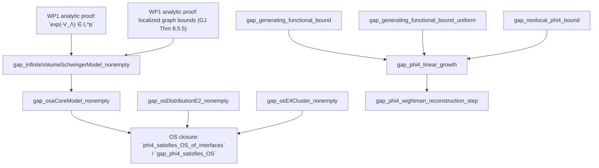
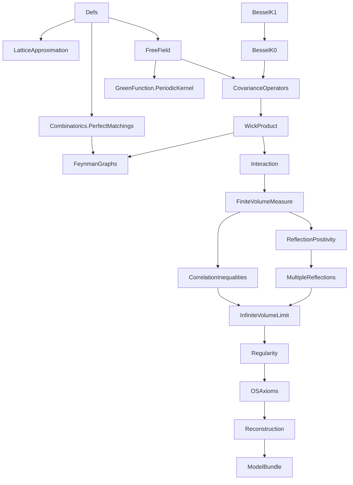
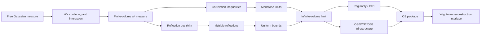
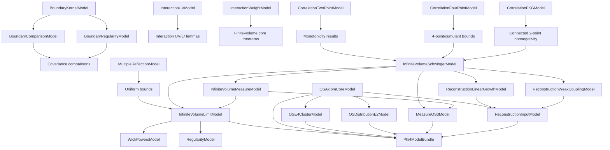

# TODO: 2D φ⁴ Project Development Plan

## Canonical Goal And Architecture (Authoritative)

The primary goal is the Glimm-Jaffe `φ⁴₂` pipeline:

1. construct infinite-volume Schwinger functions,
2. establish OS axioms (OS0-OS4, with explicit weak-coupling control for OS4),
3. reconstruct Wightman functions from the OS package.

All work packages and checklists in this file are interpreted in that order.
`...Model` classes represent explicit proof obligations in this pipeline.
Upstream blocker inventories are supporting context only and must not override
the local Glimm-Jaffe objective.

## Status Snapshot (2026-03-04)

- Core modules (`Phi4/**/*.lean`, excluding `Phi4/Scratch`) have `0`
  theorem-level `sorry`.
- This does not imply construction closure: open obligations are intentionally
  explicit at the frontier boundary (`58` `...Model` interfaces, `10` canonical
  theorem-level `gap_*` frontiers).
- Route-surface status (post-prune): `34` `theorem .*_nonempty_of_`
  constructors.
- Scratch modules (`Phi4/Scratch/**/*.lean`) have `0` theorem-level `sorry`.
- `Phi4/**/*.lean` has `0` `axiom` declarations.
- `Phi4/**/*.lean` has `0` `def/abbrev := by sorry`.
- Targeted verification gates (`scripts/quick_gate.sh`,
  `scripts/route_bloat_guard.sh`) pass.
- `lakefile.lean` pins `GaussianField` and `OSReconstruction` to immutable
  commit hashes for reproducible builds.
- `scripts/check_phi4_trust.sh` now enforces pinned core git dependencies and
  emits machine-readable frontier inventory at
  `docs/frontier_obligations/frontier.tsv`.
- `scripts/quick_gate.sh` / `scripts/weekly_gate.sh` now include:
  - `scripts/scratch_guard.sh` (scratch count/naming hygiene),
  - `scripts/frontier_report.sh` (explicit frontier inventory report).
- `scripts/upstream_sorry_report.sh` now emits pinned-upstream risk inventory
  (`docs/upstream_blockers/generated/upstream_sorry_report.txt`), including
  `os_to_wightman_full` `sorryAx` status.
- `scripts/check_phi4_trust.sh` now also enforces that selected trusted
  interface/bundle endpoints are free of `sorryAx` dependencies (`#print axioms` check).
- `Phi4/InfiniteVolumeLimit/Part1.lean` now reduces assumption smuggling at the
  public endpoint layer: `schwinger_uniformly_bounded` no longer carries an
  unused limit hypothesis, `infinite_volume_schwinger_exists` no longer carries
  an unused uniform-bound hypothesis, and
  `gap_infiniteVolumeSchwingerModel_nonempty` is now the direct constructor
  (not a theorem-alias wrapper).
- The shifted geometric-moment WP1 bridge now has assumption-explicit cores in
  both `Interaction` and `Reconstruction`:
  `interactionWeightModel_nonempty_of_uv_cutoff_seq_shifted_exponential_moment_geometric_bound_of_aestronglyMeasurable_and_standardSeq_tendsto_ae`
  and
  `gap_phi4_linear_growth_of_uv_cutoff_seq_shifted_exponential_moment_geometric_bound_of_aestronglyMeasurable_and_standardSeq_tendsto_ae`,
  with `[InteractionUVModel]` theorem forms retained as wrappers.
- `Phi4/Interaction/Part1Core.lean` and `Phi4/Reconstruction/Part1Core.lean`
  now also provide direct `q > 0` geometric exponential-moment entry points
  (`interactionWeightModel_nonempty_of_standardSeq_succ_tendsto_ae_and_geometric_exp_moment_bound`,
  `interactionWeightModel_nonempty_of_tendsto_ae_and_geometric_exp_moment_bound`,
  `gap_phi4_linear_growth_of_tendsto_ae_and_geometric_exp_moment_bound`), and
  the same `q > 0` shape is now propagated through the squared-moment WP1
  bridge
  (`interactionWeightModel_nonempty_of_sq_moment_polynomial_bound_and_geometric_exp_moment_bound`,
  `gap_phi4_linear_growth_of_sq_moment_polynomial_bound_and_geometric_exp_moment_bound`),
  aligning WP1 assumptions with the Glimm-Jaffe 8.6.2 shape and avoiding
  unrealistic geometric hypotheses at `p = 0`.
- `Phi4/Interaction/Part1Tail.lean` now includes a deterministic-growth bridge
  from linear shifted-cutoff lower bounds to geometric exponential moments
  (`standardSeq_succ_geometric_exp_moment_bound_of_linear_lower_bound`) and a
  direct constructor
  (`interactionWeightModel_nonempty_of_tendsto_ae_and_linear_lower_bound`);
  `Phi4/Reconstruction/Part1Core.lean` now exposes the corresponding
  linear-growth frontier
  (`gap_phi4_linear_growth_of_tendsto_ae_and_linear_lower_bound`).
- `Phi4/Interaction/Part3.lean` now also includes the corresponding full-model
  constructor from square-data UV control plus deterministic linear shifted
  lower bounds:
  `interactionIntegrabilityModel_nonempty_of_sq_integrable_data_and_linear_lower_bound`.
- `Phi4/Reconstruction/Part1Tail.lean` and `Phi4/Reconstruction/Part3.lean`
  now include matching hard-core per-volume WP1 routes (and higher-moment
  generalizations) from square-data UV assumptions:
  `reconstructionLinearGrowthModel_nonempty_of_sq_integrable_data_and_sq_moment_polynomial_bound_per_volume_and_uniform_partition_bound`,
  `reconstructionInputModel_nonempty_of_sq_integrable_data_and_sq_moment_polynomial_bound_per_volume_and_uniform_partition_bound`,
  `phi4_wightman_exists_of_os_and_productTensor_dense_and_normalized_order0_of_sq_integrable_data_and_sq_moment_polynomial_bound_per_volume_and_uniform_partition_bound`,
  `phi4_wightman_exists_of_interfaces_of_sq_integrable_data_and_sq_moment_polynomial_bound_per_volume_and_uniform_partition_bound`,
  plus the corresponding higher-moment (`2j`) theorem family with
  `_higher_moment_polynomial_bound_per_volume_and_uniform_partition_bound`.
  Matching graph-natural `(n+2)^(-β)` decay theorem families are now also
  available (with `_of_succ_succ` suffix) at all four reconstruction stages:
  linear-growth model, reconstruction-input model, dense-product endpoint, and
  interface-level Wightman endpoint (for both squared and higher moments).
- `Phi4/Interaction/Part3.lean` now also exposes concrete partition-function
  endpoints for the same per-volume hard-core routes (squared-moment and
  higher-moment):
  `partition_function_pos_of_sq_integrable_data_and_sq_moment_polynomial_bound_per_volume_and_uniform_partition_bound`,
  `partition_function_integrable_of_sq_integrable_data_and_sq_moment_polynomial_bound_per_volume_and_uniform_partition_bound`,
  and higher-moment (`2j`) counterparts.
- `Phi4/Interaction/Part1Tail.lean` now also includes graph-index alignment
  lemmas for hard-core per-volume WP1 assembly:
  `natCast_succ_two_rpow_neg_le_succ_one_rpow_neg`,
  `interactionWeightModel_nonempty_of_sq_moment_polynomial_bound_per_volume_and_uniform_partition_bound_of_succ_succ`,
  and
  `interactionWeightModel_nonempty_of_higher_moment_polynomial_bound_per_volume_and_uniform_partition_bound_of_succ_succ`,
  so graph-natural `(n+2)^(-β)` decay hypotheses can be consumed by the
  production `(n+1)^(-β)` constructors without ad hoc rewrites.
  `Phi4/Interaction/Part3.lean` now also contains the matching integrability
  constructors:
  `interactionIntegrabilityModel_nonempty_of_sq_integrable_data_and_sq_moment_polynomial_bound_per_volume_and_uniform_partition_bound_of_succ_succ`
  and
  `interactionIntegrabilityModel_nonempty_of_sq_integrable_data_and_higher_moment_polynomial_bound_per_volume_and_uniform_partition_bound_of_succ_succ`.
  The same `(n+2)^(-β)` route now also has concrete partition-function
  endpoints:
  `partition_function_pos_of_sq_integrable_data_and_sq_moment_polynomial_bound_per_volume_and_uniform_partition_bound_of_succ_succ`,
  `partition_function_integrable_of_sq_integrable_data_and_sq_moment_polynomial_bound_per_volume_and_uniform_partition_bound_of_succ_succ`,
  and higher-moment (`2j`) counterparts.
- `Phi4/FiniteVolumeMeasure.lean` now also includes corresponding probability
  endpoints for the per-volume hard-core routes:
  `finiteVolumeMeasure_isProbability_of_sq_integrable_data_and_sq_moment_polynomial_bound_per_volume_and_uniform_partition_bound`
  and
  `finiteVolumeMeasure_isProbability_of_sq_integrable_data_and_higher_moment_polynomial_bound_per_volume_and_uniform_partition_bound`.
  Matching graph-natural `(n+2)^(-β)` decay endpoints are also available:
  `finiteVolumeMeasure_isProbability_of_sq_integrable_data_and_sq_moment_polynomial_bound_per_volume_and_uniform_partition_bound_of_succ_succ`
  and
  `finiteVolumeMeasure_isProbability_of_sq_integrable_data_and_higher_moment_polynomial_bound_per_volume_and_uniform_partition_bound_of_succ_succ`.
- This explicit linear-lower-bound route is now also available at concrete
  partition-function/Wightman endpoints:
  `partition_function_pos_of_tendsto_ae_and_linear_lower_bound`,
  `partition_function_integrable_of_tendsto_ae_and_linear_lower_bound`
  (`Phi4/Interaction/Part3.lean`), and
  `phi4_wightman_exists_of_interfaces_of_tendsto_ae_and_linear_lower_bound`
  (`Phi4/Reconstruction/Part3.lean`).
- `Phi4/Interaction.lean` now also includes absolute-exponential-moment
  Chernoff infrastructure:
  `shifted_cutoff_bad_event_measure_le_of_exponential_moment_abs_bound` and
  `shifted_cutoff_bad_event_geometric_bound_of_exponential_moment_abs_bound`.
- `Phi4/Interaction.lean` now also includes direct shifted absolute-moment to
  signed-moment WP1 bridges and downstream interfaces/endpoints:
  `shifted_exponential_moment_geometric_bound_of_abs`,
  `exp_interaction_Lp_of_uv_cutoff_seq_shifted_exponential_moment_abs_geometric_bound`,
  `interactionWeightModel_nonempty_of_uv_cutoff_seq_shifted_exponential_moment_abs_geometric_bound`,
  and
  `interactionIntegrabilityModel_nonempty_of_uv_cutoff_seq_shifted_exponential_moment_abs_geometric_bound`
  (plus square-data variants).
- `Phi4/Interaction/Part1Tail.lean` now also provides reusable higher-moment
  tail infrastructure (`abs_pow_level_set_eq`,
  `higher_moment_markov_ennreal`,
  `tail_summable_of_moment_polynomial_decay`), extending the existing squared-
  moment Chebyshev route to general `2j`-moment (`j > 0`) summability inputs.
- The shifted exponential Wick-sublevel branch now also has assumption-explicit
  cores for interaction, reconstruction-linear-growth/input, and Wightman
  endpoints (with class-based theorem forms retained only as compatibility
  wrappers).
- Upstream blocker triage is now automated via
  `scripts/upstream_blockers_scan.sh` (inventory + file/declaration queues +
  status merge), `scripts/sync_upstream_blockers_todo.sh` (TODO sync), and
  `scripts/upstream_blockers_status.sh` (queue status operations); declaration
  prompt/workpack generation is available via
  `scripts/upstream_blockers_prompt.sh` and
  `scripts/upstream_blockers_workpack.sh`.
- Upstream OS→Wightman bridge is isolated in `Phi4/ReconstructionUpstream.lean`;
  core reconstruction remains backend-abstract (`WightmanReconstructionModel`).
- `Phi4/Regularity.lean` now includes concrete constructor chains from explicit
  data to full regularity packaging, including
  `uniformGeneratingFunctionalBoundModel_nonempty_of_global_uniform`,
  `nonlocalPhi4BoundModel_nonempty_of_global_uniform`, and
  `regularityModel_nonempty_of_wick_eom_exhaustion_limit_global_uniform`.
- New WP1 infrastructure module `Phi4/FeynmanGraphs/LocalizedBounds.lean` adds
  reusable factorial occupancy bounds for localized graph estimates.
- `Phi4/FeynmanGraphs/LocalizedBounds.lean` now also provides weighted occupancy
  inequalities (`∏ (N! * A^N) ≤ (∑ N)! * A^(∑ N)`) and graph-specialized forms
  for vertex leg counts.
- `FeynmanGraph` now enforces endpoint validity (`line_valid`) and
  `Phi4/FeynmanGraphs/LocalizedBounds.lean` now proves exact leg-line counting
  identities (`2 * |lines| = Σ legs`, parity, and half-count corollary), which
  are concrete prerequisites for localized graph bounds in the WP1 chain.
- `Phi4/FeynmanGraphs/LocalizedBounds.lean` now also rewrites vertex-occupancy
  factorial/power bounds in pure line-count form (e.g. powers indexed by
  `Σ legs` converted to powers indexed by `|lines|`), further reducing the
  remaining combinatorial debt for Theorem 8.5.5.
- `Phi4/FeynmanGraphs/LocalizedBounds.lean` now adds bounded-degree graph
  controls turning `∏_v (legs(v)!)` into pure power bounds in `Σ legs(v)` and
  `|lines|` (`vertex_factorial_prod_le_degree_factorial_pow_total_legs`,
  `vertex_factorial_prod_le_degree_factorial_pow_lines`), which is a key bridge
  toward `const ^ |lines|` localized estimates under degree caps (e.g. φ⁴).
- `Phi4/FeynmanGraphs/LocalizedBounds.lean` now also includes cardinality
  consequences of degree/valence data:
  `total_legs_le_mul_card_of_degree_le`,
  `two_mul_lines_card_le_mul_card_of_degree_le`,
  constant-valence exact formulas, and φ⁴-specialized identities
  (`lines_card_eq_two_mul_vertices_of_phi4`,
  `two_mul_lines_card_eq_four_mul_vertices_of_phi4`).
- `Phi4/FeynmanGraphs/LocalizedBounds.lean` now also provides a degree-capped
  weighted occupancy bound in pure line-count form
  (`vertex_factorial_weighted_prod_le_degree_const_pow_lines`), i.e.
  `∏ (legs! * A^legs) ≤ (((d!)^2 * A^2) ^ |lines|)` for `A ≥ 0`.
- `Phi4/FeynmanGraphs/LocalizedBounds.lean` now includes a direct bridge from
  weighted occupancy estimates to pure `C^|lines|` graph-integral bounds under
  degree caps:
  `graphIntegral_abs_le_const_pow_lines_of_degree_weighted_bound`.
- `Phi4/FeynmanGraphs/LocalizedBounds.lean` now also provides a family-level
  positive-constant uniformization theorem
  `uniform_graphIntegral_abs_le_pos_const_pow_lines_of_degree_weighted_family`,
  giving `∃ C > 0` such that all degree-capped weighted-bound graphs satisfy
  `|I(G)| ≤ C^|lines(G)|`.
- `Phi4/FeynmanGraphs/LocalizedBounds.lean` now adds direct model-bridge
  constructors from weighted degree-capped assumptions:
  `localized_graph_bound_of_degree_weighted_family` and
  `feynmanGraphEstimateModel_nonempty_of_expansion_and_degree_weighted`.
- `Phi4/FeynmanGraphs/LocalizedBounds.lean` now also includes φ⁴-specialized
  bridge wrappers (`d = 4`):
  `localized_graph_bound_of_phi4_weighted_family` and
  `feynmanGraphEstimateModel_nonempty_of_expansion_and_phi4_weighted`.
- `Phi4/FeynmanGraphs/LocalizedBounds.lean` now also includes **local** φ⁴
  weighted-bound bridges (per-graph/per-family hypotheses, without global
  valence assumptions):
  `graphIntegral_abs_le_const_pow_lines_of_phi4_weighted_bound` and
  `uniform_graphIntegral_abs_le_pos_const_pow_lines_of_phi4_weighted_family_local`.
- `Phi4/FeynmanGraphs/LocalizedBounds.lean` now also converts φ⁴ line-count
  bounds to vertex-count bounds:
  `pow_lines_eq_pow_vertices_of_phi4`,
  `graphIntegral_abs_le_const_pow_vertices_of_phi4`,
  `graphIntegral_abs_le_const_pow_vertices_of_phi4_weighted_bound`,
  and
  `uniform_graphIntegral_abs_le_pos_const_pow_vertices_of_phi4_weighted_family_local`.
- `Phi4/FeynmanGraphs/LocalizedBounds.lean` now also includes exact/sharp φ⁴
  weighted simplifications:
  `vertex_factorial_weighted_prod_eq_const_pow_vertices_of_phi4` and
  `graphIntegral_abs_le_const_pow_vertices_of_phi4_weighted_bound_sharp`
  (yielding `|I(G)| ≤ (((4! * A^4) * B^2)^|V|)` under the weighted hypothesis).
- `Phi4/FeynmanGraphs/LocalizedBounds.lean` now also controls finite φ⁴ graph
  expansions in sharp vertex-count form:
  `sum_abs_graphIntegral_le_card_mul_const_pow_vertices_of_phi4_weighted_sharp`
  and
  `feynman_expansion_abs_le_card_mul_const_pow_vertices_of_phi4_weighted_sharp`.
- `Phi4/FeynmanGraphs/LocalizedBounds.lean` now also provides generic finite
  graph-family/expansion controls from per-graph `K^|V|` bounds
  (`sum_abs_graphIntegral_le_card_mul_const_pow_vertices`,
  `feynman_expansion_abs_le_card_mul_const_pow_vertices`) plus a local φ⁴
  weighted-family corollary that extracts `K > 0` and applies it to a concrete
  expansion:
  `feynman_expansion_abs_le_card_mul_uniform_const_pow_vertices_of_phi4_weighted_family_local`.
- `Phi4/FeynmanGraphs/LocalizedBounds.lean` now also adds cardinality-growth
  reduction to pure exponential form when `#graphs ≤ N^|V|`:
  `feynman_expansion_abs_le_const_pow_vertices_of_card_bound` and
  the local φ⁴ weighted-family corollary
  `feynman_expansion_abs_le_uniform_const_pow_vertices_of_phi4_weighted_family_local`.
- `Phi4/FeynmanGraphs/LocalizedBounds.lean` now also includes explicit
  non-existential local φ⁴ weighted expansion constants:
  `feynman_expansion_abs_le_card_mul_explicit_const_pow_vertices_of_phi4_weighted_family_local`
  and
  `feynman_expansion_abs_le_explicit_uniform_const_pow_vertices_of_phi4_weighted_family_local`.
- `Phi4/FeynmanGraphs/LocalizedBounds.lean` now also provides localization-map
  (per-cell/per-square style) occupancy infrastructure:
  `factorial_prod_le_factorial_sum_fiberwise`,
  `factorial_prod_le_factorial_sum_fiberwise_real`,
  `factorial_weighted_prod_le_factorial_sum_pow_fiberwise`,
  and graph-specialized vertex-to-cell transfer lemmas
  `graph_vertex_factorial_prod_le_cell_occupancy_real`,
  `graph_vertex_factorial_weighted_prod_le_cell_occupancy_weighted`,
  their canonical-image corollaries
  (`graph_vertex_factorial_prod_le_cell_occupancy_real_image`,
   `graph_vertex_factorial_weighted_prod_le_cell_occupancy_weighted_image`),
  plus the direct graph-integral bridge
  `graphIntegral_abs_le_cell_occupancy_weighted_of_vertex_weighted_bound`
  and its canonical-image form
  `graphIntegral_abs_le_cell_occupancy_weighted_of_vertex_weighted_bound_image`;
  additionally, φ⁴-localized per-cell rewriting is now explicit via
  `graphIntegral_abs_le_cell_occupancy_weighted_of_phi4_vertex_weighted_bound`
  (occupancies `4 * #(vertices in cell)` and line factor `B^(2|V|)`), with
  finite-expansion lifting to `#graphs`-scaled bounds for fixed localization
  maps:
  `feynman_expansion_abs_le_card_mul_cell_occupancy_weighted_of_phi4_vertex_weighted`.
- `Phi4/FeynmanGraphs/LocalizedBounds.lean` now also links localized φ⁴
  occupancy data back to global factorial-moment forms:
  `phi4_sum_cell_occupancies_eq_four_mul_vertices`,
  `phi4_cell_occupancy_weighted_prod_le_total_factorial_pow`,
  `graphIntegral_abs_le_total_factorial_pow_vertices_of_phi4_weighted_bound`,
  `sum_abs_graphIntegral_le_card_mul_total_factorial_pow_vertices_of_phi4_weighted`,
  and
  `feynman_expansion_abs_le_card_mul_total_factorial_pow_vertices_of_phi4_weighted`.
- `Phi4/FeynmanGraphs/LocalizedBounds.lean` now also provides generic
  degree-capped weighted-family conversion to vertex-exponential expansion
  bounds:
  `graphIntegral_abs_le_const_pow_vertices_of_degree_weighted_bound` and
  `feynman_expansion_abs_le_uniform_const_pow_vertices_of_degree_weighted_family`
  (with explicit graph-count growth input `#graphs ≤ N^|V|`), plus explicit
  and all-arity moment-level endpoints:
  `feynman_expansion_abs_le_explicit_uniform_const_pow_vertices_of_degree_weighted_family`,
  `gaussian_moment_abs_le_explicit_uniform_const_pow_of_degree_weighted_expansion_data`,
  `gaussian_moment_abs_le_uniform_const_pow_of_degree_weighted_expansion_data`.
- `Phi4/FeynmanGraphs/LocalizedBounds.lean` now also lifts local φ⁴
  weighted-family finite-expansion bounds to all-arity Gaussian-moment
  endpoints:
  `gaussian_moment_abs_le_explicit_uniform_const_pow_of_phi4_weighted_expansion_data_local`
  and
  `gaussian_moment_abs_le_uniform_const_pow_of_phi4_weighted_expansion_data_local`.
- `Phi4/Interaction.lean` now provides a reusable measure-theoretic bridge
  `memLp_exp_neg_of_ae_lower_bound` (and the interaction specialization
  `exp_interaction_Lp_of_ae_lower_bound`) for the Chapter 8 route from
  semiboundedness/tail bounds to `exp(-V_Λ) ∈ Lᵖ`.
- `Phi4/Interaction.lean` now also includes nonempty witness-composition
  constructors across UV/weight/full interfaces:
  `interactionUVModel_nonempty_of_integrability_nonempty`,
  `interactionWeightModel_nonempty_of_integrability_nonempty`,
  `interactionIntegrabilityModel_nonempty_of_uv_weight_nonempty`.
- `Phi4/Interaction.lean` now also includes square-integrability-to-`L²`
  constructor routes for UV/full interaction packaging:
  `interactionCutoff_memLp_two_of_sq_integrable`,
  `interaction_memLp_two_of_sq_integrable`,
  `interactionUVModel_nonempty_of_sq_integrable_data`,
  `interactionIntegrabilityModel_nonempty_of_sq_integrable_data`.
- `Phi4/Interaction.lean` now also adds a direct square-integrable-data +
  shifted-cutoff geometric-moment constructor path:
  `interactionIntegrabilityModel_nonempty_of_sq_integrable_data_and_uv_cutoff_seq_shifted_exponential_moment_geometric_bound`,
  plus concrete partition-function endpoints
  `partition_function_pos_of_sq_integrable_data_and_uv_cutoff_seq_shifted_exponential_moment_geometric_bound` and
  `partition_function_integrable_of_sq_integrable_data_and_uv_cutoff_seq_shifted_exponential_moment_geometric_bound`.
- `Phi4/Interaction.lean` now also exposes direct `exp(-V_Λ) ∈ L^p` endpoints
  from shifted-cutoff exponential-moment geometric decay, both at UV-interface
  level and via square-integrable UV data:
  `exp_interaction_Lp_of_uv_cutoff_seq_shifted_exponential_moment_geometric_bound`,
  `exp_interaction_Lp_of_sq_integrable_data_and_uv_cutoff_seq_shifted_exponential_moment_geometric_bound`.
- `Phi4/Interaction.lean` now also provides a reusable global bridge from the
  same shifted-cutoff exponential-moment geometric assumptions to shifted
  geometric bad-event tails at threshold `0`:
  `shifted_cutoff_bad_event_geometric_bound_of_uv_cutoff_seq_shifted_exponential_moment_geometric_bound`.
- `Phi4/Interaction.lean` now also derives eventual cutoff nonnegativity and
  limiting-interaction AE nonnegativity from these shifted-cutoff moment-decay
  hypotheses:
  `cutoff_seq_eventually_nonneg_of_uv_cutoff_seq_shifted_exponential_moment_geometric_bound`,
  `interaction_ae_nonneg_of_uv_cutoff_seq_shifted_exponential_moment_geometric_bound`,
  and correspondingly routes
  `exp_interaction_Lp_of_uv_cutoff_seq_shifted_exponential_moment_geometric_bound`
  through the nonnegativity-transfer chain.
- `Phi4/Interaction.lean` now also includes a globalized nonnegativity endpoint
  across all rectangles
  (`interaction_ae_nonneg_all_rectangles_of_uv_cutoff_seq_shifted_exponential_moment_geometric_bound`)
  and a direct square-integrable-data constructor for
  `InteractionWeightModel` from the same shifted geometric-moment input
  (`interactionWeightModel_nonempty_of_sq_integrable_data_and_uv_cutoff_seq_shifted_exponential_moment_geometric_bound`).
  This removes unnecessary detours through full
  `InteractionIntegrabilityModel` in the square-data partition-function and
  finite-volume probability endpoints.
- `Phi4/Interaction.lean` now also includes a square-integrable-data route
  driven by shifted-index exponential tails of Wick sublevel bad events:
  `interactionIntegrabilityModel_nonempty_of_sq_integrable_data_and_uv_cutoff_seq_shifted_exponential_wick_sublevel_bad_sets`,
  plus UV-level and square-integrable concrete partition-function endpoints
  `partition_function_pos_of_uv_cutoff_seq_shifted_exponential_wick_sublevel_bad_sets`,
  `partition_function_integrable_of_uv_cutoff_seq_shifted_exponential_wick_sublevel_bad_sets`,
  and
  `partition_function_pos_of_sq_integrable_data_and_uv_cutoff_seq_shifted_exponential_wick_sublevel_bad_sets` and
  `partition_function_integrable_of_sq_integrable_data_and_uv_cutoff_seq_shifted_exponential_wick_sublevel_bad_sets`.
- `Phi4/Interaction.lean` now also provides cutoff-sequence lower-bound transfer
  lemmas and direct constructors
  (`interactionWeightModel_nonempty_of_cutoff_seq_lower_bounds`,
  `interactionIntegrabilityModel_nonempty_of_uv_cutoff_seq_lower_bounds`)
  so constructive cutoff bounds can instantiate the Chapter 8 interfaces directly.
- `Phi4/Interaction.lean` now additionally supports eventually-in-cutoff (`∀ᶠ n`)
  AE lower-bound transfer and matching constructors
  (`interactionWeightModel_nonempty_of_cutoff_seq_eventually_lower_bounds`,
  `interactionIntegrabilityModel_nonempty_of_uv_cutoff_seq_eventually_lower_bounds`),
  reducing the need for all-`n` lower-bound assumptions.
- `Phi4/Interaction.lean` now also supports variable per-cutoff constants
  (`Bₙ`) with eventual uniform control (`Bₙ ≤ B` eventually) via
  `exp_interaction_Lp_of_cutoff_seq_variable_lower_bounds` and matching
  weight/integrability constructors.
- `Phi4/Interaction.lean` now also supports Borel-Cantelli transfer from
  summable cutoff bad-event tails to eventual almost-sure cutoff lower bounds,
  with corresponding `exp_interaction_Lp` and weight/integrability constructors;
  and now includes majorant variants using explicit summable envelopes
  (`μ badₙ ≤ εₙ`, `∑ εₙ < ∞`) plus geometric-tail specializations
  (`μ badₙ ≤ C rⁿ`, `r < 1`) and exponential-tail specializations
  (`μ badₙ ≤ C * exp(-α n)`, `α > 0`).
- `Phi4/Interaction.lean` now also includes direct limiting-interaction
  lower-bound entry points:
  measurable-only `exp_interaction_Lp` bridge
  `exp_interaction_Lp_of_ae_lower_bound_of_aestronglyMeasurable`,
  direct weight-model constructors from per-volume AE lower bounds
  (`interactionWeightModel_nonempty_of_ae_lower_bounds`,
   `interactionWeightModel_nonempty_of_ae_lower_bounds_of_aestronglyMeasurable`),
  and the corresponding UV+AE integrability constructor
  `interactionIntegrabilityModel_nonempty_of_uv_ae_lower_bounds`.
- `Phi4/Interaction.lean` now also has direct pointwise-cutoff lower-bound
  constructors (`∀ ω`, `∀ n`) feeding the same pipeline:
  `interactionWeightModel_nonempty_of_cutoff_seq_pointwise_lower_bounds` and
  `interactionIntegrabilityModel_nonempty_of_uv_cutoff_seq_pointwise_lower_bounds`.
- `Phi4/Interaction.lean` now also includes semibounded-Wick to cutoff-interaction
  bridges:
  `interactionCutoff_lower_bound_of_wick_lower_bound`,
  `interactionCutoff_lower_bound_of_wick_semibounded`,
  and shifted-sequence extraction
  `interactionCutoff_pointwise_lower_bounds_of_standardSeq_succ_wick_semibounded`.
- `Phi4/Interaction.lean` now also bridges Wick-level good-set lower bounds
  (outside bad sets) to cutoff and model-level integrability constructors:
  `interactionCutoff_lower_bound_of_wick_lower_bound_on_good_set`,
  `interactionCutoff_pointwise_lower_bounds_of_standardSeq_succ_wick_bad_sets`,
  `interactionWeightModel_nonempty_of_uv_cutoff_seq_shifted_summable_wick_bad_sets`,
  `interactionIntegrabilityModel_nonempty_of_uv_cutoff_seq_shifted_summable_wick_bad_sets`.
- `Phi4/Interaction.lean` now also adds geometric/exponential bad-tail
  specializations for the Wick good-set route (still shifted in `κ_{n+1}`):
  `interactionWeightModel_nonempty_of_uv_cutoff_seq_shifted_geometric_wick_bad_sets`,
  `interactionWeightModel_nonempty_of_uv_cutoff_seq_shifted_exponential_wick_bad_sets`,
  `interactionIntegrabilityModel_nonempty_of_uv_cutoff_seq_shifted_geometric_wick_bad_sets`,
  `interactionIntegrabilityModel_nonempty_of_uv_cutoff_seq_shifted_exponential_wick_bad_sets`.
- `Phi4/Interaction.lean` now also provides direct `exp_interaction_Lp`
  endpoints for the same Wick bad-set hypotheses (without going through model
  construction first):
  `exp_interaction_Lp_of_cutoff_seq_shifted_summable_wick_bad_sets`,
  `exp_interaction_Lp_of_cutoff_seq_shifted_geometric_wick_bad_sets`,
  `exp_interaction_Lp_of_cutoff_seq_shifted_exponential_wick_bad_sets`.
- `Phi4/Interaction.lean` now also supports the natural Wick sublevel bad-event
  form directly (`{ω | ∃ x ∈ Λ, wickPower(κ_{n+1}) ω x < -B}`), with parallel
  theorem families at all three layers (`exp_interaction_Lp`,
  `InteractionWeightModel`, `InteractionIntegrabilityModel`):
  `*_shifted_{summable,geometric,exponential}_wick_sublevel_bad_sets`.
- `Phi4/Interaction.lean` now also includes a direct Chernoff/Markov
  moment-to-tail bridge for shifted cutoff events:
  `shifted_cutoff_bad_event_measure_le_of_exponential_moment` and
  `shifted_cutoff_bad_event_measure_le_of_exponential_moment_bound`,
  connecting exponential-moment control of `interactionCutoff(κ_{n+1})`
  to explicit bad-event probability bounds.
- `Phi4/Interaction.lean` now also adds direct geometric-moment closure for the
  same shifted cutoff route:
  `shifted_cutoff_bad_event_geometric_bound_of_exponential_moment_bound`,
  `interactionWeightModel_nonempty_of_uv_cutoff_seq_shifted_exponential_moment_geometric_bound`,
  `interactionIntegrabilityModel_nonempty_of_uv_cutoff_seq_shifted_exponential_moment_geometric_bound`,
  plus nonempty-model entrypoints
  `partition_function_pos_of_nonempty_interactionWeightModel` and
  `partition_function_integrable_of_nonempty_interactionWeightModel`,
  and direct moment-assumption partition-function endpoints
  `partition_function_pos_of_uv_cutoff_seq_shifted_exponential_moment_geometric_bound`,
  `partition_function_integrable_of_uv_cutoff_seq_shifted_exponential_moment_geometric_bound`.
- `Phi4/FiniteVolumeMeasure.lean` now includes nonempty/concrete entrypoints
  for the finite-volume probability theorem:
  `finiteVolumeMeasure_isProbability_of_nonempty_interactionWeightModel` and
  `finiteVolumeMeasure_isProbability_of_uv_cutoff_seq_shifted_exponential_moment_geometric_bound`,
  `finiteVolumeMeasure_isProbability_of_uv_cutoff_seq_shifted_exponential_wick_sublevel_bad_sets`,
  plus
  `finiteVolumeMeasure_isProbability_of_sq_integrable_data_and_uv_cutoff_seq_shifted_exponential_moment_geometric_bound`,
  and
  `finiteVolumeMeasure_isProbability_of_sq_integrable_data_and_uv_cutoff_seq_shifted_exponential_wick_sublevel_bad_sets`.
- `Phi4/Interaction.lean` now also supports shifted canonical-sequence (`κ_{n+1}`)
  lower-bound transfer and constructors, reducing direct `n = 0` obligations:
  `cutoff_seq_eventually_lower_bound_of_succ`,
  `interaction_ae_lower_bound_of_cutoff_seq_succ`,
  `exp_interaction_Lp_of_cutoff_seq_succ_lower_bounds`,
  `interactionWeightModel_nonempty_of_cutoff_seq_succ_lower_bounds`,
  `interactionWeightModel_nonempty_of_cutoff_seq_succ_pointwise_lower_bounds`,
  `interactionIntegrabilityModel_nonempty_of_uv_cutoff_seq_succ_lower_bounds`,
  `interactionIntegrabilityModel_nonempty_of_uv_cutoff_seq_succ_pointwise_lower_bounds`.
- `Phi4/Interaction.lean` now also has generic summable-bad-set entry points
  (arbitrary bad sets with good-set cutoff lower bounds), including
  `interaction_ae_lower_bound_of_cutoff_seq_bad_set_summable`,
  `exp_interaction_Lp_of_cutoff_seq_bad_set_summable`,
  and model constructors
  `interactionWeightModel_nonempty_of_cutoff_seq_summable_bad_sets`,
  `interactionIntegrabilityModel_nonempty_of_uv_cutoff_seq_summable_bad_sets`.
- `Phi4/Interaction.lean` now also has shifted-index (`κ_{n+1}`) Borel-Cantelli
  adapters for summable bad-event tails, so estimates naturally stated for
  `κ > 1` feed directly into the canonical cutoff pipeline:
  `eventually_atTop_of_eventually_atTop_succ`,
  `cutoff_seq_eventually_lower_bound_of_shifted_bad_set_summable`,
  `cutoff_seq_eventually_lower_bound_of_shifted_summable_bad_event_measure`,
  `interaction_ae_lower_bound_of_cutoff_seq_shifted_summable_bad_event_measure`,
  `exp_interaction_Lp_of_cutoff_seq_shifted_summable_bad_event_measure`,
  plus shifted majorant/geometric/exponential tail variants
  (`cutoff_seq_eventually_lower_bound_of_shifted_summable_bad_event_bound`,
   `cutoff_seq_eventually_lower_bound_of_shifted_geometric_bad_event_bound`,
   `cutoff_seq_eventually_lower_bound_of_shifted_exponential_bad_event_bound`,
   `exp_interaction_Lp_of_cutoff_seq_shifted_summable_bad_event_bound`,
   `exp_interaction_Lp_of_cutoff_seq_shifted_geometric_bad_event_bound`,
   `exp_interaction_Lp_of_cutoff_seq_shifted_exponential_bad_event_bound`)
  and corresponding shifted model constructors for weight/integrability
  (`interactionWeightModel_nonempty_of_cutoff_seq_shifted_summable_bad_event_measure`,
   `interactionWeightModel_nonempty_of_cutoff_seq_shifted_summable_bad_event_bound`,
   `interactionWeightModel_nonempty_of_cutoff_seq_shifted_geometric_bad_event_bound`,
   `interactionWeightModel_nonempty_of_cutoff_seq_shifted_exponential_bad_event_bound`,
   `interactionIntegrabilityModel_nonempty_of_uv_cutoff_seq_shifted_summable_bad_event_measure`,
   `interactionIntegrabilityModel_nonempty_of_uv_cutoff_seq_shifted_summable_bad_event_bound`,
   `interactionIntegrabilityModel_nonempty_of_uv_cutoff_seq_shifted_geometric_bad_event_bound`,
   `interactionIntegrabilityModel_nonempty_of_uv_cutoff_seq_shifted_exponential_bad_event_bound`).
- `Phi4/InfiniteVolumeLimit.lean` now includes direct `k = 4` infinite-volume
  existence bridges from correlation packages:
  `infinite_volume_schwinger_exists_four_of_correlationFourPoint_models` and
  `infinite_volume_schwinger_exists_four_of_correlationCore_models`, plus
  package-level endpoints
  `infinite_volume_schwinger_exists_four_of_correlationInequality_models` and
  `infinite_volume_schwinger_exists_four_of_lattice_and_core_models`, reducing
  manual instance plumbing on the monotonicity path
  (`Correlation*` → `SchwingerNMonotoneModel params 4` → IV existence).
- `docs/CLAUDE_TO_CODEX_TRACKER.md` now tracks systematic remediation of
  issues raised in `claude_to_codex.md`.
- `Phi4/LatticeApproximation.lean` now provides rectangular mesh geometry,
  discretization maps, Riemann-sum identities, and monotonicity lemmas.
- `Phi4/Combinatorics/PerfectMatchings.lean` now centralizes pairing/perfect-matching
  combinatorics for Wick/Feynman expansion infrastructure.
- `Phi4/Combinatorics/PerfectMatchings.lean` now also exposes a public
  vertex-partner API for pairings (`Pairing.incidentPair`, `Pairing.partner`)
  with core correctness lemmas (`incidentPair_mem`, `incidentPair_contains`,
  `incidentPair_eq_of_mem_left/right`, `partner_eq_of_mem_left/right`,
  `partner_ne_self`, `partner_partner`, and partner-edge membership), plus
  uniqueness/cardinality controls for edges containing a fixed vertex
  (`pair_eq_incidentPair_of_mem_contains`,
   `mem_filter_contains_iff_eq_incidentPair`,
   `card_filter_pairs_containing_eq_one`,
   `card_erase_incidentPair`,
   `card_erase_incidentPair_eq_sub_one`,
   `pairs_card_eq_half`) and recursion-ready erase/partner lemmas
  (`incidentPair_contains_partner`,
   `incidentPair_partner_eq`,
   `not_mem_erase_incidentPair_contains`,
   `not_mem_erase_incidentPair_contains_partner`,
   `filter_erase_incidentPair_contains_eq_empty`,
   `filter_erase_incidentPair_contains_partner_eq_empty`,
   `two_mul_card_erase_incidentPair`,
   `card_erase_incidentPair_eq_half_sub_two`);
  this is foundational infrastructure for recursive pairing-count and
  Wick-expansion constructions.
- `PairingEnumerationModel` now records only cardinality of pairings; enumeration
  itself is canonical via `Finset.univ`.
- `Phi4/CovarianceOperators.lean` now exposes boundary-covariance subinterfaces
  (`BoundaryKernelModel`, `BoundaryComparisonModel`, `BoundaryRegularityModel`)
  plus derived quadratic comparison lemmas (`C_D ≤ C ≤ C_N` consequences).
- `Phi4/FreeField.lean` now includes a direct model-construction bridge from
  two-point kernel identities:
  `freeCovarianceKernelModel_nonempty_of_two_point_kernel`.
- `Phi4/FreeField.lean` now exports reusable free-kernel Bessel
  representation/off-diagonal bounds (`freeCovKernel_eq_besselK0` and
  `K₁`-comparison consequences) for downstream covariance estimates.
- `Phi4/ReflectionPositivity.lean` now requires only boundary-kernel data for
  Dirichlet RP assumptions (`BoundaryKernelModel`), consistent with the covariance split.
- `Phi4/ModelBundle.lean` now carries boundary kernel/comparison/regularity
  submodels directly; full boundary covariance is reconstructed by instance.
- `Phi4/GreenFunction/PeriodicKernel.lean` now provides concrete periodic
  image-shift and truncated lattice-sum kernel infrastructure.
- `Phi4/CorrelationInequalities.lean` now includes lattice-to-continuum
  bridge interfaces/theorems for GKS-I and 2-point monotonicity transfer,
  and now exposes correlation subinterfaces
  (`CorrelationTwoPointModel`, `CorrelationGKSSecondModel`,
  `CorrelationLebowitzModel`, `CorrelationFourPointInequalityModel`,
  `CorrelationFourPointModel`, `CorrelationFKGModel`).
- `CorrelationInequalityCoreModel` now extends
  `CorrelationGKSSecondModel`, `CorrelationLebowitzModel`, and
  `CorrelationFKGModel` directly, with only 4-point volume monotonicity
  remaining as an extra core field; this removes duplicated core inequality
  fields and keeps core assumptions explicitly atomic.
- Constructor scaffolds were added for explicit interface instantiation in
  `FreeField.lean`, `CovarianceOperators.lean`, and `CorrelationInequalities.lean`
  (`*_nonempty_of_data` theorems), so WP2/WP3 proof data can be ported into
  stable class instances without ad hoc wrapper code.
- `Phi4/CorrelationInequalities.lean` now also provides core constructor bridges
  that source 4-point monotonicity from monotone-moment interfaces:
  `correlationInequalityCoreModel_nonempty_of_data_and_schwingerFourMonotone`
  and the lattice-specialized
  `correlationInequalityCoreModel_nonempty_of_data_and_lattice_monotone`;
  full continuum constructors are now explicit via
  `correlationInequalityModel_nonempty_of_data` and
  `correlationInequalityModel_nonempty_of_twoPoint_and_core`;
  atomic-subinterface constructors are also available via
  `correlationInequalityCoreModel_nonempty_of_models` and
  `correlationInequalityModel_nonempty_of_submodels_and_schwingerFourMonotone`;
  full correlation model constructors from lattice bridge data plus
  GKS-II/FKG/Lebowitz inputs are now available via
  `correlationInequalityModel_nonempty_of_lattice_and_core_data` and
  `correlationInequalityModel_nonempty_of_lattice_and_core_data_and_lattice_monotone`,
  with model-level (non-data) lattice assembly variants
  `correlationInequalityModel_nonempty_of_lattice_and_core_models` and
  `correlationInequalityModel_nonempty_of_lattice_and_core_models_and_lattice_monotone`.
- `Phi4/InfiniteVolumeLimit.lean` and `Phi4/Reconstruction.lean` now use
  minimal correlation assumptions by theorem block (two-point/four-point/FKG).
- `Phi4/InfiniteVolumeLimit.lean` now exposes
  `InfiniteVolumeSchwingerModel` + `InfiniteVolumeMeasureModel`, with
  `InfiniteVolumeLimitModel` reconstructed by compatibility instance.
- Infinite-volume inequality/convergence theorem blocks in
  `Phi4/InfiniteVolumeLimit.lean` and wrappers in `Phi4/Reconstruction.lean`
  now use `InfiniteVolumeSchwingerModel` where measure representation is unused.
- `Phi4/InfiniteVolumeLimit.lean` now provides constructive two-point
  exhaustion lemmas sourced from `MultipleReflectionModel`:
  `schwingerTwo_uniformly_bounded_on_exhaustion`,
  `schwingerTwo_tendsto_iSup_of_models`,
  `schwingerTwo_limit_exists_of_models`,
  with lattice and `schwingerN` (`k = 2`) model-driven variants, plus
  interface-shaped `if h : 0 < n then ... else 0` convergence/existence
  theorems in the two-point channel (including
  `infinite_volume_schwinger_exists_two_of_models` and
  `infinite_volume_schwinger_exists_two_of_lattice_models`).
- `Phi4/InfiniteVolumeLimit.lean` now has a reusable permutation-transfer
  lemma `infiniteVolumeSchwinger_perm`, with
  `infiniteVolumeSchwinger_two_symm` now proved from it.
- `Phi4/InfiniteVolumeLimit.lean` now has reusable infinite-volume connected
  two-point linearity/bilinearity infrastructure:
  `connectedTwoPoint_add_left`, `connectedTwoPoint_smul_left`,
  `connectedTwoPoint_add_right`, `connectedTwoPoint_smul_right`,
  `connectedTwoPointBilinear`, `connectedTwoPointBilinear_symm`,
  `connectedTwoPointBilinear_self_nonneg`; and
  `connectedTwoPoint_quadratic_nonneg` now uses this bilinear route.
- `Phi4/CorrelationInequalities.lean` now includes generic finite-volume
  `k`-point monotonicity/nonnegativity infrastructure
  `SchwingerNMonotoneModel` / `SchwingerNNonnegModel` (with
  `k = 2` instances from `CorrelationTwoPointModel` and lattice monotonicity
  constructors),
  plus family-level interfaces
  `SchwingerNMonotoneFamilyModel` / `LatticeSchwingerNMonotoneFamilyModel`
  with compatibility bridges from family assumptions to fixed-arity interfaces;
  `CorrelationFourPointInequalityModel` now isolates GKS-II/Lebowitz
  assumptions from monotonicity, while `CorrelationFourPointModel` carries
  explicit 4-point volume
  monotonicity (`schwinger_four_monotone`), inducing
  `SchwingerNMonotoneModel params 4`.
- Four-point inequality theorem blocks in `Phi4/InfiniteVolumeLimit.lean` and
  `Phi4/Reconstruction.lean` (and finite-volume bound blocks in
  `Phi4/CorrelationInequalities.lean`) now depend on
  atomic `CorrelationGKSSecondModel` + `CorrelationLebowitzModel`
  (not full 4-point monotonicity) when monotonicity data is unused;
  `CorrelationFourPointInequalityModel` is reconstructed by compatibility.
- `Phi4/CorrelationInequalities.lean` now includes the canonical instance
  `correlationFourPointModel_of_inequality_and_schwingerFourMonotone`, so
  atomic GKS-II/Lebowitz + `SchwingerNMonotoneModel params 4` assumptions
  reconstruct `CorrelationFourPointModel` directly via typeclass inference.
- The public finite-volume 4-point monotonicity endpoint
  `schwinger_four_monotone` now depends on the minimal interface
  `SchwingerNMonotoneModel params 4` (not `CorrelationFourPointModel`).
- `Phi4/ModelBundle.lean` now relies on these global atomic bridge instances
  and no longer manually rebuilds four-point wrapper instances inside the
  bundle projection path.
- `Phi4/InfiniteVolumeLimit.lean` now includes generic `k`-point monotone
  convergence/existence infrastructure:
  `schwingerN_monotone_in_volume_of_model`,
  `schwingerN_tendsto_iSup_of_monotone_bounded`,
  `schwingerN_limit_exists_of_monotone_bounded`,
  `schwingerN_tendsto_iSup_of_models`,
  `schwingerN_limit_exists_of_models`,
  `schwingerN_tendsto_if_exhaustion_of_models`,
  `schwingerN_limit_exists_if_exhaustion_of_models`,
  `infinite_volume_schwinger_exists_k_of_models`,
  `infinite_volume_schwinger_exists_all_k_of_family_models`,
  `infinite_volume_schwinger_exists_all_k_of_lattice_family_models`,
  `infinite_volume_schwinger_exists_four_of_models`,
  `infinite_volume_schwinger_exists_four_of_lattice_models`,
  and routes two-point endpoints through these generic theorems; the
  specialized `k = 2` / `k = 4` existence wrappers now use the minimal
  monotonicity assumptions (`SchwingerNMonotoneModel params 2/4`) rather than
  stronger correlation bundles, and the shifted two-point `iSup` convergence/
  existence wrappers (`schwingerTwo_tendsto_iSup_of_monotone_bounded`,
  `schwingerTwo_tendsto_iSup_of_models`,
  `schwingerTwo_limit_exists_of_monotone_bounded`,
  `schwingerTwo_limit_exists_of_models`) now follow the same minimal interface;
  non-shifted `if h : 0 < n then ... else 0` two-point forms are now expressed
  via `SchwingerNMonotoneModel params 2` plus
  `SchwingerNNonnegModel params 2` for the `n = 0` positivity branch, by
  specialization of generic non-shifted `k`-point convergence.
- In `Phi4/InfiniteVolumeLimit.lean`, lattice iSup-form two-point convergence
  theorems now use shifted exhaustion sequences `(n + 1)` and no longer require
  `LatticeGriffithsFirstModel`
  (`schwingerTwo_tendsto_if_exhaustion_of_lattice_models`,
   `schwingerN_two_tendsto_if_exhaustion_of_lattice_models`).
- The legacy lattice+core `k = 4` IV endpoint
  `infinite_volume_schwinger_exists_four_of_lattice_and_core_models` now uses
  only `CorrelationInequalityCoreModel` + `MultipleReflectionModel`; the
  theorem no longer carries unused lattice GKS-I assumptions.
- `Phi4/ModelBundle.lean` now carries infinite-volume Schwinger/measure/moment
  submodels directly and reconstructs `InfiniteVolumeLimitModel` by instance.
- `Phi4/MultipleReflections.lean` now keeps `MultipleReflectionModel` focused on
  the genuine chessboard/uniform-Schwinger inputs only; the previously vacuous
  existential-`C` partition-function ratio bounds were removed from the model
  interface and are proved directly as standalone theorems with precise
  assumptions.
- The standalone reflection-layer partition-function endpoints now return
  nonnegative constants explicitly (`0 ≤ C`) and use meaningful assumptions
  (`determinant_bound` depends on `InteractionWeightModel`), reducing
  degenerate/vacuous statement shapes.
- `Phi4/OSAxioms.lean` now places `MeasureOS3Model` on the weaker
  measure-only assumptions, and `phi4_os3` follows this reduced interface.
- `OSAxiomCoreModel`, `OSE4ClusterModel`, and `OSDistributionE2Model` are now
  decoupled from `InfiniteVolumeLimitModel`; `phi4_satisfies_OS` now depends on
  the OS-package interfaces directly rather than a separate IV-limit hypothesis.
- `Phi4/Reconstruction.lean` now places
  `ConnectedTwoPointDecayAtParams`, `UniformWeakCouplingDecayModel`,
  `ReconstructionInputModel`, and `WightmanReconstructionModel` on
  `InfiniteVolumeSchwingerModel` rather than `InfiniteVolumeLimitModel`.
- `ConnectedTwoPointDecayAtParams` now uses a physically sound statement:
  uniform positive mass gap with test-function-pair-dependent amplitudes,
  avoiding an over-strong single global amplitude constant.
- `ReconstructionInputModel` is now split into
  `ReconstructionLinearGrowthModel` + `ReconstructionWeakCouplingModel`,
  with compatibility reconstruction kept for existing APIs.
- `ReconstructionLinearGrowthModel` is now decoupled from
  `InfiniteVolumeSchwingerModel`; linear-growth/Wightman interface endpoints now
  depend only on OS-package + E0' data where Schwinger-limit inputs are not used.
- `phi4_satisfies_OS` and fixed-parameter Wightman interface corollaries were
  further trimmed to remove unused `InfiniteVolumeSchwingerModel` assumptions in
  their signatures, tightening the non-smuggled dependency surface.
- `InfiniteVolumeMeasureModel` now carries only measure/probability data, with
  Schwinger moment representation split into `InfiniteVolumeMomentModel`; the
  `InfiniteVolumeLimitModel` reconstruction instance now requires this explicit
  moment bridge instead of bundling it into the measure interface.
- `MeasureOS3Model` is now explicitly measure-level (depends only on
  `InfiniteVolumeMeasureModel`), removing an unnecessary Schwinger-package
  dependency from OS3 reflection-positivity assumptions.
- `WickPowersModel` and `RegularityModel` now depend only on
  `InfiniteVolumeMeasureModel` (rather than `InfiniteVolumeLimitModel`),
  reducing model-surface coupling and avoiding assumption smuggling through the
  larger package.
- `ReconstructionWeakCouplingModel` is now derivable from
  `UniformWeakCouplingDecayModel` via
  `reconstructionWeakCouplingModel_of_uniform`, reducing duplicated
  fixed-parameter weak-coupling assumptions when uniform decay data is available.
- `Phi4/ModelBundle.lean` now stores reconstruction linear-growth and
  global weak-coupling decay inputs directly; fixed-parameter weak-coupling
  thresholds are reconstructed by instance.
- `Reconstruction.lean` now provides
  `phi4_wightman_exists_of_interfaces` as a trusted interface-level
  endpoint, and `Phi4/ModelBundle.lean` now uses this theorem in
  `phi4_wightman_exists_of_bundle` (bypassing frontier-gap wrappers).
- `Reconstruction.lean` now includes trusted interface-level downstream
  corollaries (`phi4_selfadjoint_fields_of_interfaces`,
  `phi4_locality_of_interfaces`, `phi4_lorentz_covariance_of_interfaces`,
  `phi4_unique_vacuum_of_interfaces`) with matching bundle wrappers.
- `Reconstruction.lean` now includes an `ε`-`R` clustering consequence of
  connected two-point exponential decay
  (`connectedTwoPoint_decay_eventually_small`) and its weak-coupling-threshold
  specialization
  (`phi4_connectedTwoPoint_decay_below_threshold_eventually_small`), plus an
  explicit-Schwinger `ε`-`R` variant
  (`phi4_connectedTwoPoint_decay_below_threshold_eventually_small_explicit`),
  with bundled wrappers in `ModelBundle.lean`.
- `Reconstruction.lean` now also includes global weak-coupling `ε`-`R`
  clustering theorems
  (`phi4_os4_weak_coupling_eventually_small`,
  `phi4_os4_weak_coupling_eventually_small_explicit`) from
  `UniformWeakCouplingDecayModel`, with bundled wrappers.
- `ModelBundle.lean` now exposes bundled wrappers for both base global OS4
  weak-coupling decay forms and their `ε`-`R` variants.
- `translateTestFun` is now a public `Reconstruction.lean` helper so bundled
  theorem signatures can state translated-test-function clustering directly.
- `OSAxioms.lean` now includes trusted OS1 theorem
  `phi4_os1_of_interface`; `ModelBundle.lean` now exposes `phi4_os1_of_bundle`.
- `Phi4/ModelBundle.lean` now carries correlation inputs in atomic form
  (`CorrelationTwoPointModel`, `CorrelationGKSSecondModel`,
  `CorrelationLebowitzModel`, `SchwingerNMonotoneModel params 4`,
  `CorrelationFKGModel`); full `CorrelationFourPointInequalityModel`,
  `CorrelationFourPointModel`, and `CorrelationInequalityModel` are
  reconstructed by instance.
- `Phi4/HonestGaps.lean` now forwards to canonical core frontiers and contains no local `sorry`.
- `Phi4/HonestGaps.lean` now also forwards the new UV shifted geometric-moment
  linear-growth bridge frontier
  (`gap_phi4_linear_growth_of_uv_cutoff_seq_shifted_exponential_moment_geometric_bound`).
- FKG-derived connected two-point nonnegativity statements now explicitly
  require nonnegative test functions (corrected soundness of statement direction).
- `gap_phi4_linear_growth` in `Phi4/Reconstruction.lean` is no longer an
  identity frontier wrapper: it now derives E0' from explicit weak-coupling OS
  packaging plus concrete generating-functional/product-tensor hypotheses
  (`huniform`, `hcompat`, `hreduce`, `hdense`) via
  `phi4_linear_growth_of_interface_productTensor_approx_and_normalized_order0`.
- `Phi4/Reconstruction.lean` now also exposes an explicit zero-mode
  normalization frontier split for E0':
  `gap_phi4_linear_growth_of_zero_mode_normalization` plus reusable zero-mode
  bridges
  (`phi4_productTensor_zero_of_compat_of_zero`,
   `phi4_normalized_order0_of_linear_and_compat_of_zero`,
   `phi4_linear_growth_of_interface_productTensor_approx_and_given_normalized_order0`);
  legacy `gap_phi4_linear_growth` now discharges this zeroth-mode input via
  `infiniteVolumeSchwinger_zero`.
- The same E0' route now also has an explicit mixed-bound core bridge
  (`phi4_linear_growth_of_mixed_bound_productTensor_approx_and_given_normalized_order0`);
  `gap_phi4_linear_growth_of_zero_mode_normalization` no longer assumes
  `InteractionWeightModel` and instead takes this mixed product-tensor bound as
  explicit frontier data, while `gap_phi4_linear_growth` remains the
  compatibility wrapper that constructs it from uniform generating-functional
  bounds under `InteractionWeightModel`.
- `Phi4/Reconstruction.lean` now includes direct WP1→WP5 bridge endpoints that
  avoid requiring a pre-installed `InteractionWeightModel`:
  `gap_phi4_linear_growth_of_uv_cutoff_seq_shifted_exponential_moment_geometric_bound`
  and
  `phi4_wightman_exists_of_os_and_productTensor_dense_and_normalized_order0_of_uv_cutoff_seq_shifted_exponential_moment_geometric_bound`.
- `Phi4/Reconstruction.lean` now also includes constructive model/interface
  closure from the same WP1-style shifted geometric-moment assumptions:
  `reconstructionLinearGrowthModel_nonempty_of_uv_cutoff_seq_shifted_exponential_moment_geometric_bound`
  and
  `phi4_wightman_exists_of_interfaces_of_uv_cutoff_seq_shifted_exponential_moment_geometric_bound`.
- `Phi4/Reconstruction.lean` now further lifts this to aggregate reconstruction
  input packaging via
  `reconstructionInputModel_nonempty_of_uv_cutoff_seq_shifted_exponential_moment_geometric_bound`,
  so weak-coupling and linear-growth assumptions can be consumed as a single
  constructive model witness.
- `Phi4/Reconstruction.lean` now also includes square-integrable-data variants
  of this shifted-geometric reconstruction chain, so the same WP1 bridge no
  longer requires a pre-installed `InteractionUVModel`:
  `gap_phi4_linear_growth_of_sq_integrable_data_and_uv_cutoff_seq_shifted_exponential_moment_geometric_bound`,
  `reconstructionLinearGrowthModel_nonempty_of_sq_integrable_data_and_uv_cutoff_seq_shifted_exponential_moment_geometric_bound`,
  `reconstructionInputModel_nonempty_of_sq_integrable_data_and_uv_cutoff_seq_shifted_exponential_moment_geometric_bound`,
  `phi4_wightman_exists_of_os_and_productTensor_dense_and_normalized_order0_of_sq_integrable_data_and_uv_cutoff_seq_shifted_exponential_moment_geometric_bound`,
  and
  `phi4_wightman_exists_of_interfaces_of_sq_integrable_data_and_uv_cutoff_seq_shifted_exponential_moment_geometric_bound`.
- These square-data reconstruction endpoints now consume the direct
  square-data `InteractionWeightModel` constructor (from `Interaction.lean`)
  rather than instantiating an intermediate local `InteractionUVModel`
  wrapper in their proof bodies.
- `Phi4/Reconstruction.lean` now also includes UV-level and square-integrable
  reconstruction-chain endpoints from shifted-index exponential Wick sublevel
  bad-event tails:
  `gap_phi4_linear_growth_of_uv_cutoff_seq_shifted_exponential_wick_sublevel_bad_sets`,
  `reconstructionLinearGrowthModel_nonempty_of_uv_cutoff_seq_shifted_exponential_wick_sublevel_bad_sets`,
  `reconstructionInputModel_nonempty_of_uv_cutoff_seq_shifted_exponential_wick_sublevel_bad_sets`,
  `gap_phi4_linear_growth_of_sq_integrable_data_and_uv_cutoff_seq_shifted_exponential_wick_sublevel_bad_sets`,
  `reconstructionLinearGrowthModel_nonempty_of_sq_integrable_data_and_uv_cutoff_seq_shifted_exponential_wick_sublevel_bad_sets`,
  `reconstructionInputModel_nonempty_of_sq_integrable_data_and_uv_cutoff_seq_shifted_exponential_wick_sublevel_bad_sets`,
  `phi4_wightman_exists_of_os_and_productTensor_dense_and_normalized_order0_of_uv_cutoff_seq_shifted_exponential_wick_sublevel_bad_sets`,
  `phi4_wightman_exists_of_os_and_productTensor_dense_and_normalized_order0_of_sq_integrable_data_and_uv_cutoff_seq_shifted_exponential_wick_sublevel_bad_sets`,
  `phi4_wightman_exists_of_interfaces_of_uv_cutoff_seq_shifted_exponential_wick_sublevel_bad_sets`,
  and
  `phi4_wightman_exists_of_interfaces_of_sq_integrable_data_and_uv_cutoff_seq_shifted_exponential_wick_sublevel_bad_sets`.
- The UV-level Wick-sublevel reconstruction/linear-growth routes now also use
  direct
  `interactionWeightModel_nonempty_of_uv_cutoff_seq_shifted_exponential_wick_sublevel_bad_sets`
  in proof bodies (no intermediate
  `InteractionIntegrabilityModel`-to-`InteractionWeightModel` conversion).
- Square-data Wick-sublevel endpoints now also use direct
  `interactionWeightModel_nonempty_of_sq_integrable_data_and_uv_cutoff_seq_shifted_exponential_wick_sublevel_bad_sets`
  (eliminating local `InteractionUVModel` instantiation in these
  finite-volume/reconstruction/reconstruction-input/Wightman-interface/partition-function
  proof bodies).
- `gap_phi4_wightman_reconstruction_step` in `Phi4/Reconstruction.lean` now
  routes through `WightmanReconstructionModel` (interface-backed theorem) rather
  than taking a raw reconstruction function argument.
- Remaining gap to final theorem is not placeholder closure; it is replacement of high-level assumption interfaces with internal constructive proofs.

## Main Blocking Gaps (2026-03-01)

These are the mathematically blocking items for proving 2D `phi^4` satisfies OS
axioms (not interface-shape work):

Distance-to-goal assessment:
- Not close yet: the deepest remaining Glimm-Jaffe analytic blocker is WP1
  interaction integrability (Theorem 8.6.2 hard core), specifically the
  uniform cutoff partition-function estimate.
- Downstream `gap_*` frontiers are mostly handoff points that cannot be closed
  honestly until those WP1/WP2 analytic inputs are grounded constructively.

1. `WP1` interaction integrability (`exp(-V_Λ) ∈ L^p`) is not constructively grounded.
   Sharpest unresolved theorem target:
   for each `Λ` and `q > 0`, prove uniform cutoff partition-function control
   `∃ D, ∀ n, ∫ exp(-q · interactionCutoff(κ_{n+1})) dφ_C ≤ D`.
   Together with quantitative shifted UV-difference squared-moment decay
   (`β > 1`), this now feeds directly into the production hard-core bridges
   `interactionWeightModel_nonempty_of_sq_moment_polynomial_bound_per_volume_and_uniform_partition_bound`
   (`Phi4/Interaction/Part1Tail.lean`) and
   `interactionIntegrabilityModel_nonempty_of_sq_integrable_data_and_sq_moment_polynomial_bound_per_volume_and_uniform_partition_bound`
   (`Phi4/Interaction/Part3.lean`), then further into reconstruction via
   `reconstructionLinearGrowthModel_nonempty_of_sq_integrable_data_and_sq_moment_polynomial_bound_per_volume_and_uniform_partition_bound`
   (`Phi4/Reconstruction/Part1Tail.lean`) and
   `phi4_wightman_exists_of_interfaces_of_sq_integrable_data_and_sq_moment_polynomial_bound_per_volume_and_uniform_partition_bound`
   (`Phi4/Reconstruction/Part3.lean`).
   A generalized higher-moment (`2j`) version is also in place:
   `interactionWeightModel_nonempty_of_higher_moment_polynomial_bound_per_volume_and_uniform_partition_bound`
   and
   `interactionIntegrabilityModel_nonempty_of_sq_integrable_data_and_higher_moment_polynomial_bound_per_volume_and_uniform_partition_bound`.
2. `WP1` localized graph bounds (GJ Theorem 8.5.5) are formalized in
   `Phi4/FeynmanGraphs/LocalizedBounds.lean`; remaining work is to connect
   this infrastructure to the uniform cutoff partition-function bound above.
3. `gap_infiniteVolumeSchwingerModel_nonempty` in `Phi4/InfiniteVolumeLimit/Part1.lean`.
4. `gap_generating_functional_bound` in `Phi4/Regularity.lean`.
5. `gap_generating_functional_bound_uniform` in `Phi4/Regularity.lean`.
6. `gap_nonlocal_phi4_bound` in `Phi4/Regularity.lean`.
7. `gap_osaCoreModel_nonempty` in `Phi4/OSAxioms.lean`.
8. `gap_osDistributionE2_nonempty` in `Phi4/OSAxioms.lean`.
9. `gap_osE4Cluster_nonempty` in `Phi4/OSAxioms.lean`.
10. `gap_phi4_linear_growth` in `Phi4/Reconstruction/Part1Core.lean`.
11. `gap_phi4_wightman_reconstruction_step` in `Phi4/Reconstruction/Part1Tail.lean`.

### Strict Theorem-Dependency Frontier (Current)



Current execution policy:
- Freeze additional interface splitting unless it is required by a concrete proof.
- Prioritize bottom-up grounding of WP1 bounds and then propagate closure upward.

## Development Rules (Authoritative)

1. No `axiom` declarations in `Phi4`.
2. No fake placeholders or vacuous theorem statements.
3. Keep statements mathematically sound and aligned with Glimm-Jaffe.
4. Prefer proving reusable intermediate lemmas over one-off theorem hacks.

## Comprehensive Dependency / Flowchart

### A. Lean Module DAG



### B. Mathematical Proof Flow



### C. Interface-Dependency Layer (Current Architecture)



## Work Packages (Priority Order)

## WP1: Interaction Integrability Closure

Goal: replace `InteractionIntegrabilityModel` assumptions by internal proofs of the key Chapter 8 integrability statements.

Current sharpest blocking subgoal (Theorem 8.6.2 core):
- prove per-rectangle geometric cutoff exponential-moment bounds
  `E[exp(-θ · interactionCutoff(κ_{n+1}))] ≤ D * r^n` with `r < 1`.
  This is the exact hypothesis shape consumed by
  `interactionWeightModel_nonempty_of_uv_cutoff_seq_shifted_exponential_moment_geometric_bound`
  and downstream reconstruction/Wightman interface endpoints.

New infrastructure now in place (WP1 hard-core reduction):
- `standardSeq_succ_exp_moment_integral_on_bad_set_le_of_memLp_two` (Cauchy bad-part bridge).
- `toReal_geometric_bad_set_bound_of_ennreal` (bridges ENNReal geometric
  bad-set tails to real-valued geometric bounds).
- `standardSeq_succ_geometric_bad_part_integral_bound_of_sq_exp_moment_geometric_and_bad_measure_geometric`
  (converts geometric second moments + geometric bad-set measures to the
  geometric bad-part integral bound expected by decomposition theorems).
- `standardSeq_succ_geometric_bad_part_integral_bound_of_sq_exp_moment_geometric_and_bad_measure_geometric_ennreal`
  (same bridge but directly from ENNReal bad-set tails).
- `standardSeq_succ_geometric_exp_moment_bound_of_linear_lower_bound_off_bad_sets_and_sq_exp_moment_geometric_and_bad_measure_geometric`
  (one-stop composition with linear-off-bad lower bounds).
- `standardSeq_succ_geometric_exp_moment_bound_of_linear_lower_bound_off_bad_sets_and_sq_exp_moment_geometric_and_bad_measure_geometric_ennreal`
  (same one-stop composition with ENNReal tail inputs).
- `standardSeq_succ_sq_exp_moment_data_of_double_exponential_moment_geometric_bound`
  (derives `MemLp(·,2)` + squared-moment decomposition data for `exp(-q*cutoff)`
  from geometric doubled-parameter moments `exp(-(2q)*cutoff)`).
- `standardSeq_succ_geometric_exp_moment_bound_of_linear_lower_bound_off_bad_sets_and_double_exp_moment_geometric_and_bad_measure_geometric_ennreal`
  (one-stop ENNReal decomposition route using doubled-parameter moments).
- `shifted_cutoff_bad_event_geometric_bound_of_exponential_moment_bound_linear_threshold`
  and
  `shifted_cutoff_bad_event_exists_ennreal_geometric_bound_of_exponential_moment_bound_linear_threshold`
  (linear-threshold Chernoff bridge from geometric shifted-cutoff
  `exp(-q * interactionCutoff)` moments to ENNReal geometric bad-set tails).
- `shifted_cutoff_bad_event_geometric_bound_of_exponential_moment_abs_bound_linear_threshold`
  and
  `shifted_cutoff_bad_event_exists_ennreal_geometric_bound_of_exponential_moment_abs_bound_linear_threshold`
  (absolute-exponential-moment version of the same linear-threshold bad-tail
  bridge).
- `interactionIntegrabilityModel_nonempty_of_sq_integrable_data_and_linear_lower_bound_off_bad_sets_and_sq_exp_moment_geometric_and_bad_measure_geometric_ennreal`
  (production full-model bridge in `Interaction/Part3`).
- `interactionIntegrabilityModel_nonempty_of_sq_integrable_data_and_linear_threshold_geometric_exp_moment_and_double_exp_moment_geometric`
  (production full-model bridge that consumes geometric `q` and `2q`
  shifted-cutoff moments directly, deriving the square-data branch internally).
- `interactionIntegrabilityModel_nonempty_of_sq_integrable_data_and_linear_threshold_geometric_exp_moment_and_double_exp_moment_geometric_of_moment_bounds`
  (weakened variant that also derives `q`-level integrability from
  `MemLp(·,2)` under the free-field probability measure).
- `interactionIntegrabilityModel_nonempty_of_sq_integrable_data_and_linear_threshold_geometric_exp_moment_and_double_exp_moment_abs_geometric_of_moment_bounds`
  (mixed signed/absolute doubled-moment route: signed `q` branch plus absolute
  `2q` branch `exp((2q) * |interactionCutoff|)`).
- `partition_function_pos_of_sq_integrable_data_and_linear_lower_bound_off_bad_sets_and_sq_exp_moment_geometric_and_bad_measure_geometric_ennreal`
  and
  `partition_function_integrable_of_sq_integrable_data_and_linear_lower_bound_off_bad_sets_and_sq_exp_moment_geometric_and_bad_measure_geometric_ennreal`
  (concrete partition-function endpoints for the same ENNReal-tail route).
- `finiteVolumeMeasure_isProbability_of_sq_integrable_data_and_linear_lower_bound_off_bad_sets_and_sq_exp_moment_geometric_and_bad_measure_geometric_ennreal`
  (finite-volume probability endpoint in `FiniteVolumeMeasure`).
- `finiteVolumeMeasure_isProbability_of_sq_integrable_data_and_linear_threshold_geometric_exp_moment_and_double_exp_moment_geometric`
  (finite-volume probability endpoint for the doubled-parameter (`q`, `2q`)
  linear-threshold route).
- `finiteVolumeMeasure_isProbability_of_sq_integrable_data_and_linear_threshold_geometric_exp_moment_and_double_exp_moment_geometric_of_moment_bounds`
  (weaker finite-volume endpoint variant: no separate `q`-integrability
  assumption).
- `phi4_wightman_exists_of_os_and_productTensor_dense_and_normalized_order0_of_sq_integrable_data_and_linear_lower_bound_off_bad_sets_and_sq_exp_moment_geometric_and_bad_measure_geometric_ennreal`
  and
  `phi4_wightman_exists_of_interfaces_of_sq_integrable_data_and_linear_lower_bound_off_bad_sets_and_sq_exp_moment_geometric_and_bad_measure_geometric_ennreal`
  (dense/interface reconstruction endpoints for the same route).
- `reconstructionLinearGrowthModel_nonempty_of_sq_integrable_data_and_linear_threshold_geometric_exp_moment_and_double_exp_moment_geometric`
  and
  `phi4_wightman_exists_of_interfaces_of_sq_integrable_data_and_linear_threshold_geometric_exp_moment_and_double_exp_moment_geometric`
  (reconstruction linear-growth/interface Wightman endpoints for the
  doubled-parameter (`q`, `2q`) linear-threshold route).
- `reconstructionLinearGrowthModel_nonempty_of_sq_integrable_data_and_linear_threshold_geometric_exp_moment_and_double_exp_moment_geometric_of_moment_bounds`
  and
  `phi4_wightman_exists_of_interfaces_of_sq_integrable_data_and_linear_threshold_geometric_exp_moment_and_double_exp_moment_geometric_of_moment_bounds`
  (weaker variants removing separate `q`-integrability assumptions).

So the remaining analytic burden for this branch is concentrated in proving:
1. geometric shifted `2θ`-moment bounds,
2. geometric bad-set measure bounds,
for the chosen bad-set mechanism.

Deliverables:
- prove `exp_interaction_Lp` from semibounded Wick-4 + tail control,
- derive `partition_function_pos` and `partition_function_integrable` internally,
- minimize assumptions required by `finiteVolumeMeasure_isProbability`.

Exit criteria:
- `FiniteVolumeMeasure` probability and integrability theorems no longer depend on external interaction integrability assumptions.

## WP2: Correlation + Reflection Positivity Grounding

Goal: tighten the analytic source of inequalities and positivity, reducing purely abstract interfaces.

Deliverables:
- channel-precise GKS/Lebowitz inequalities (in progress; core derived channel bounds already added),
- bridge finite-volume positivity statements to OS-style positivity forms,
- remove redundant assumptions between RP layer and OS layer where derivable.

Exit criteria:
- explicit proof path from finite-volume correlation/RP statements to the OS positivity inputs used downstream.

## WP3: Infinite-Volume Construction Upgrade

Goal: reduce `InfiniteVolumeLimitModel` by proving concrete convergence/representation steps.

Progress:
- split completed: `InfiniteVolumeSchwingerModel` and `InfiniteVolumeMeasureModel`
  now isolate convergence/bounds from measure representation.
- two-point exhaustion convergence now has a constructive route where the
  absolute bound is derived internally from `MultipleReflectionModel` rather
  than passed as a separate theorem argument (both `schwingerTwo` and
  `schwingerN` for `k = 2`, including lattice-bridge variants and
  interface-style `if h : 0 < n` sequence endpoints).

Deliverables:
- strengthen monotonicity beyond the currently packaged 2-point channel,
- construct limit functionals with explicit convergence lemmas,
- prove moment representation with fewer abstract assumptions.

Exit criteria:
- at least one major field in `InfiniteVolumeLimitModel` moved from assumption to theorem.

## WP4: Regularity (OS1) Internalization

Goal: move from `RegularityModel` assumptions to proved generating-functional bounds.

Deliverables:
- formal Schwinger-Dyson / integration-by-parts chain,
- nonlocal bounds and uniform control,
- final `generating_functional_bound` theorem from project-internal lemmas.

Exit criteria:
- `phi4_os1` depends only on proven internal lemmas + clearly audited upstream results.

## WP5: OS/Reconstruction Hardening

Goal: keep final reconstruction stage sound despite upstream churn.

Deliverables:
- maintain `OSAxiomCoreModel`/`OSE4ClusterModel`/`OSDistributionE2Model`
  with minimal, non-redundant assumptions,
- keep `ReconstructionInputModel` explicit until upstream no-sorry reconstruction theorem is auditable,
- centralize handoff through `Phi4ModelBundle`.

Exit criteria:
- clean, auditable final theorem interface showing exact remaining assumptions.

## Phased Development Plan (2026-02-26)

### Model Classes to Replace (Dependency Order)

```
Level 0: BoundaryCovarianceModel, PairingEnumerationModel
Level 1: GaussianWickExpansionModel, FreeRP, DirichletRP
Level 2: FeynmanGraphEstimateModel, InteractionUV, InteractionWeight,
         CorrelationTwoPoint, CorrelationFourPoint, CorrelationFKG, InteractingRP
Level 3: FiniteVolumeComparison, MultipleReflectionModel
Level 4: InfiniteVolumeLimitModel
Level 5: WickPowersModel, RegularityModel
Level 6: OSAxiomCoreModel (now IV-limit independent), OSE4ClusterModel,
         OSDistributionE2Model, MeasureOS3Model
Level 7: ReconstructionLinearGrowthModel, ReconstructionWeakCouplingModel, ReconstructionInputModel
```

### Phase 0: Infrastructure Foundation
- [x] **0A** (Codex): Combinatorial pairings — `Phi4/Combinatorics/PerfectMatchings.lean`
- [ ] **0B** (Claude): Boundary covariance kernels — `Phi4/GreenFunction/{Dirichlet,Neumann,Periodic}Kernel.lean`
- [x] **0C** (Codex): Lattice approximation framework — `Phi4/LatticeApproximation.lean`

### Phase 1: Gaussian Estimates & Correlation Inequalities
- [ ] **1A** (Claude): Wick expansion + graph bounds → instantiate `GaussianWickExpansionModel`, `FeynmanGraphEstimateModel`
- [ ] **1B** (Codex+Claude): Correlation inequalities via lattice/core →
      instantiate `CorrelationTwoPointModel` + `CorrelationFourPointModel` +
      `CorrelationFKGModel` (and hence `CorrelationInequalityModel`)
- [ ] **1C** (Claude): `exp_interaction_Lp` (GJ 8.6.2) → instantiate `InteractionIntegrabilityModel`

### Phase 2: Reflection Positivity & Multiple Reflections
- [ ] **2A** (Claude): Free covariance RP (Fourier space)
- [ ] **2B** (Claude): Dirichlet + interacting RP (GJ 10.4)
- [ ] **2C** (Claude): Chessboard estimate (GJ 10.5.5) + uniform bound (GJ 11.3.1) — **hardest**
- [ ] **2D** (Claude): Finite volume comparison from Lebowitz

### Phase 3: Infinite Volume Construction
- [ ] **3A** (Claude): Schwinger convergence (monotone bounded → convergent)
- [ ] **3B** (Claude): Measure construction (Bochner-Minlos or Riesz-Markov)
- [ ] **3C** (Codex): Monotonicity extension beyond k=2
      generic deep infrastructure is now in place
      (`SchwingerNMonotoneModel`,
      `SchwingerNMonotoneFamilyModel`,
      `LatticeSchwingerNMonotoneFamilyModel`,
      and all-arity existence endpoints); remaining work is concrete
      `k > 2` monotonicity proofs/instances.

### Phase 4: Regularity & OS Axioms
- [ ] **4A** (Claude): Wick powers in infinite volume (GJ 12.2.1)
- [ ] **4B** (Claude): Schwinger-Dyson equation (GJ 12.2.3)
- [ ] **4C** (Claude): Generating functional bound (GJ 12.5.1) — **most analytically demanding**
- [ ] **4D** (Codex+Claude): OS axiom packaging (OS0-OS3)

### Phase 5: Cluster Expansion & Reconstruction
- [ ] **5A** (Claude+Codex): Cluster expansion infrastructure
- [ ] **5B** (Claude): OS4 for weak coupling
- [ ] **5C** (Claude): Linear growth condition bridge
- [ ] **5D** (Codex): Wightman reconstruction bridging

### Agent Coordination
- **Claude Code**: proof-heavy tasks (PDE, analysis, MCP-assisted interactive proving)
- **Codex**: structural code generation (combinatorics, lattice framework, API packaging)

## Immediate Next Queue

1. Complete Phase 0B (Claude: boundary covariance).
2. Continue Phase 1B (Codex+Claude): instantiate lattice/core bridge models
   to discharge correlation submodel fields constructively.

## Upstream Blocking Proof Inventory (auto-generated)

This section is a dependency-risk dashboard only. It is not the primary work
queue; the primary queue remains the local Glimm-Jaffe `φ⁴₂` OS pipeline above.

<!-- BEGIN_UPSTREAM_BLOCKERS -->
_Generated: 2026-02-28_

Generated from `.lake/packages/OSReconstruction/OSReconstruction/**/*.lean` by mapping each `sorry` token to its enclosing declaration.

- Total `sorry` tokens: `97`.
- Unique blocking declarations: `82` across `18` files.
- Queue status counts: `open=80`, `in_progress=2`, `blocked=0`, `done=0`.
- Entries marked `(xN)` contain multiple `sorry` tokens in one declaration.

Top file priorities (score/reverse-importers/declarations/tokens):
- `Wightman/WightmanAxioms.lean`: `294 / 5 / 4 / 4`
- `ComplexLieGroups/Connectedness.lean`: `222 / 4 / 2 / 2`
- `Wightman/Reconstruction/WickRotation/OSToWightman.lean`: `199 / 1 / 13 / 14`
- `vNA/ModularAutomorphism.lean`: `173 / 2 / 6 / 8`
- `SCV/LaplaceSchwartz.lean`: `166 / 2 / 6 / 6`
- `vNA/ModularTheory.lean`: `166 / 2 / 6 / 6`
- `vNA/KMS.lean`: `145 / 1 / 8 / 10`
- `ComplexLieGroups/GeodesicConvexity.lean`: `133 / 2 / 3 / 3`
- `SCV/BochnerTubeTheorem.lean`: `122 / 2 / 2 / 2`
- `SCV/PaleyWiener.lean`: `116 / 1 / 6 / 6`

### `ComplexLieGroups/Connectedness.lean` (priority `222`, reverse importers `4`, declarations `2`, sorry tokens `2`)
- `theorem:adjacent_sectors_overlap_right`
- `theorem:iterated_eow_permutation_extension`

### `ComplexLieGroups/GeodesicConvexity.lean` (priority `133`, reverse importers `2`, declarations `3`, sorry tokens `3`)
- `theorem:cartan_exp_embedding`
- `theorem:geodesic_convexity_forwardCone`
- `theorem:polar_decomposition`

### `SCV/BochnerTubeTheorem.lean` (priority `122`, reverse importers `2`, declarations `2`, sorry tokens `2`)
- `theorem:bochner_local_extension`
- `theorem:holomorphic_extension_from_local`

### `SCV/LaplaceSchwartz.lean` (priority `166`, reverse importers `2`, declarations `6`, sorry tokens `6`)
- `theorem:fourierLaplace_boundary_continuous`
- `theorem:fourierLaplace_boundary_integral_convergence`
- `theorem:fourierLaplace_continuousWithinAt`
- `theorem:fourierLaplace_polynomial_growth`
- `theorem:fourierLaplace_uniform_bound_near_boundary`
- `theorem:polynomial_growth_of_continuous_bv`

### `SCV/PaleyWiener.lean` (priority `116`, reverse importers `1`, declarations `6`, sorry tokens `6`)
- `theorem:paley_wiener_cone`
- `theorem:paley_wiener_converse`
- `theorem:paley_wiener_half_line`
- `theorem:paley_wiener_one_step`
- `theorem:paley_wiener_one_step_simple`
- `theorem:paley_wiener_unique`

### `Wightman/NuclearSpaces/BochnerMinlos.lean` (priority `72`, reverse importers `1`, declarations `2`, sorry tokens `2`)
- `theorem:bochner_tightness_and_limit`
- `theorem:minlos_nuclearity_tightness`

### `Wightman/Reconstruction/GNSHilbertSpace.lean` (priority `68`, reverse importers `1`, declarations `1`, sorry tokens `3`)
- `def:gnsQFT` (x3)

### `Wightman/Reconstruction/Main.lean` (priority `111`, reverse importers `2`, declarations `1`, sorry tokens `1`)
- `theorem:wightman_uniqueness`

### `Wightman/Reconstruction/WickRotation/BHWExtension.lean` (priority `72`, reverse importers `1`, declarations `2`, sorry tokens `2`)
- `theorem:W_analytic_swap_distributional_agree`
- `theorem:analytic_boundary_local_commutativity`

### `Wightman/Reconstruction/WickRotation/BHWTranslation.lean` (priority `105`, reverse importers `1`, declarations `5`, sorry tokens `5`)
- `theorem:W_analytic_translated_bv_eq`
- `theorem:bv_limit_constant_along_convex_path`
- `theorem:distributional_uniqueness_forwardTube_inter`
- `theorem:forwardTube_lorentz_translate_aux_core`
- `theorem:forward_tube_bv_integrable_translated`

### `Wightman/Reconstruction/WickRotation/ForwardTubeLorentz.lean` (priority `72`, reverse importers `1`, declarations `2`, sorry tokens `2`)
- `theorem:polynomial_growth_on_slice`
- `theorem:wickRotation_not_in_PET_null`

### `Wightman/Reconstruction/WickRotation/OSToWightman.lean` (priority `199`, reverse importers `1`, declarations `13`, sorry tokens `14`)
- `theorem:bv_hermiticity_transfer`
- `theorem:bv_local_commutativity_transfer`
- `theorem:bv_lorentz_covariance_transfer`
- `theorem:bv_positive_definiteness_transfer`
- `theorem:bv_translation_invariance_transfer`
- `theorem:bv_zero_point_is_evaluation`
- `theorem:bvt_cluster`
- `theorem:extend_to_forward_tube_via_bochner`
- `theorem:forward_tube_bv_tempered`
- `theorem:full_analytic_continuation` (x2)
- `theorem:inductive_analytic_continuation`
- `theorem:iterated_analytic_continuation`
- `theorem:schwinger_holomorphic_on_base_region`

### `Wightman/Reconstruction/WickRotation/SchwingerAxioms.lean` (priority `105`, reverse importers `1`, declarations `5`, sorry tokens `5`)
- `theorem:W_analytic_cluster_integral`
- `theorem:bhw_pointwise_cluster_euclidean`
- `theorem:polynomial_growth_forwardTube_full`
- `theorem:polynomial_growth_on_PET`
- `theorem:schwinger_os_term_eq_wightman_term`

### `Wightman/WightmanAxioms.lean` (priority `294`, reverse importers `5`, declarations `4`, sorry tokens `4`)
- `theorem:pointwise_limit_along_forwardCone_direction`
- `theorem:schwartz_nuclear_extension`
- `theorem:spectrum_implies_distributional_bv`
- `theorem:wightman_separately_continuous`

### `vNA/KMS.lean` (priority `145`, reverse importers `1`, declarations `8`, sorry tokens `10`)
- `theorem:high_temperature_limit`
- `theorem:kms_characterizes_modular`
- `theorem:kms_implies_passive`
- `theorem:kms_is_equilibrium`
- `theorem:kms_unique_for_factors`
- `theorem:modular_state_is_kms` (x3)
- `theorem:passive_stable_implies_kms`
- `theorem:zero_temperature_limit`

### `vNA/MeasureTheory/CaratheodoryExtension.lean` (priority `106`, reverse importers `0`, declarations `8`, sorry tokens `16`)
- `def:spectralPremeasureFromLimit` (x7)
- `def:toComplexMeasure'`
- `def:toIntervalPremeasure` (x3)
- `theorem:borel_le_caratheodory`
- `theorem:toOuterMeasure_Icc`
- `theorem:toSpectralMeasure_Icc`
- `theorem:toSpectralMeasure_sigma_additive`
- `theorem:toSpectralMeasure_univ`

### `vNA/ModularAutomorphism.lean` (priority `173`, reverse importers `2`, declarations `6`, sorry tokens `8`)
- `theorem:approximately_inner`
- `theorem:cocycle_identity`
- `theorem:cocycle_in_algebra`
- `theorem:modular_inner_iff` (x3)
- `theorem:modular_relation`
- `theorem:preserves_algebra`

### `vNA/ModularTheory.lean` (priority `166`, reverse importers `2`, declarations `6`, sorry tokens `6`)
- `theorem:StandardForm.positiveCone_self_dual`
- `theorem:conjugates_modular_operator`
- `theorem:modular_automorphism_preserves`
- `theorem:reverses_modular_flow`
- `theorem:standard_form_unique`
- `theorem:tomita_fundamental`
<!-- END_UPSTREAM_BLOCKERS -->

## Risk Register

- Upstream `OSReconstruction` still has `sorry` in some modules; treat reconstruction usage conservatively.
- Cluster expansion / OS4 remains a major deep-analytic milestone; OS0-OS3 stand alone without it.
- Bochner-Minlos theorem for nuclear spaces likely not in Mathlib — may need axiomatization or Riesz-Markov alternative.
- Chessboard estimate / Thm 11.3.1 (uniform bound) is the hardest single analytic estimate.
- Overly abstract interfaces can drift from mathematically sharp statements; periodic statement-audit is required.
